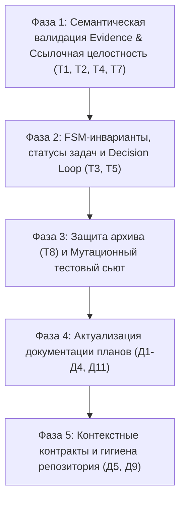

На основе детального анализа отчёта [testing-review-results.md](file:///C:/Users/ghost/workspace/rshb/edofhd/delta-fuse/docs/testing-review-results.md) сформирован пошаговый план комплексной доработки тестового фреймворка и движка валидации DeltaFuse.

План структурирован по приоритетам: от устранения критических уязвимостей бизнес-логики (мутации T1–T8) до синхронизации планов с каноническими спецификациями и наведения репозиторной гигиены.

---

# План доработки тестового фреймворка DeltaFuse

---

## 🔴 Фаза 1: Семантическая валидация Evidence и ссылочная целостность (Критический приоритет)

**Проблема**: Валидатор сейчас проверяет только физическое наличие YAML-файлов, допуская подмену Red-фазы зелёными отчётами (T1, T2), ссылки на несуществующие задачи (T4) и битые ссылки на спецификацию (T7).

### Задачи:
1. **Семантическая проверка файлов Evidence в [`fsm.py`](file:///C:/Users/ghost/workspace/rshb/edofhd/delta-fuse/src/deltafuse/core/fsm.py)**:
    - **Фазовое соответствие каталогу**: файлы в `evidence/red/` обязаны иметь `phase: red`, в `evidence/green/` — `phase: green`, в `evidence/regression/` — `phase: regression`.
    - **Инварианты результатов**:
        - `red` evidence: `result: expected-failure` (не `passed`), ненулевой `exit_code` (или явный non-zero exit code).
        - `green` и `regression` evidence: `result: passed`, `exit_code: 0`.
    - **Сверка задач**: поле `task` в evidence обязано ссылаться на реально существующий файл `tasks/TASK-*.md`.
2. **Подключение валидатора ссылок к общему пакету в [`integrity.py`](file:///C:/Users/ghost/workspace/rshb/edofhd/delta-fuse/src/deltafuse/core/integrity.py) и [`fsm.py`](file:///C:/Users/ghost/workspace/rshb/edofhd/delta-fuse/src/deltafuse/core/fsm.py)**:
    - Вызов `find_spec_anchors` внутри `validate_change_package`: проверка, что все `spec_refs` в слайсах, задачах и `spec-delta.md` реально указывают на существующие файлы в `docs/spec/` и якоря `#REQ-*` / `#SC-*`.
3. **Обновление [`change_builder.py`](file:///C:/Users/ghost/workspace/rshb/edofhd/delta-fuse/tests/fixtures/change_builder.py)**:
    - Приведение генерируемых фикстур в полное соответствие с семантическими требованиями к evidence.

---

## 🟠 Фаза 2: Статусная согласованность, FSM и Decision Convergence Loop (Высокий приоритет)

**Проблема**: Полнота пакета не сопоставляется с заявленным статусом (T5), гейт `converged` пропускает задачи в статусе `pending` (T3), а цикл архитектурных решений (`DEC-*`) не валидируется вовсе.

### Задачи:
1. **Проверка статусов задач на гейтах в [`fsm.py`](file:///C:/Users/ghost/workspace/rshb/edofhd/delta-fuse/src/deltafuse/core/fsm.py)**:
    - Гейт `converged` обязан проверять, что все задачи пакета (`tasks/TASK-*.md`) имеют терминальный статус `verified` (или `implemented`). Не допускается перевод в `converged`, если хоть одна задача осталась в `draft`, `targeting` или `pending`.
2. **Сверка заявленного `change.yaml.status` с гейтами**:
    - Запрет рассинхронизации: если Change объявлен как `converged`, он обязан удовлетворять всем предусловиям гейта `converged`.
3. **Реализация Decision Convergence Gate**:
    - Проверка наличия и статуса решений: если слайс или задача содержат `design_ref: .../DEC-*`, валидатор проверяет, что файл существует и его статус — `accepted` (не `proposed` и не `rejected`).
    - Блокировка гейта `specified`: если в Change есть неразрешённые `DEC-*` в статусе `proposed`, гейт не пропускает переход (статус `blocked-on-decision`).
4. **Тестирование терминальных веток в `tests/e2e/`**:
    - Добавление тестов для путей `rejected`, `duplicate`, `superseded` и завершённого цикла `not-reproduced`.

---

## 🟡 Фаза 3: Защита архива и мутационный тестовый сьют (Высокий приоритет)

**Проблема**: Повторная архивация тихо перезаписывает существующий архив (T8); отсутствуют регрессионные негативные тесты на дефекты T1–T8.

### Задачи:
1. **Защита архива в [`archiver.py`](file:///C:/Users/ghost/workspace/rshb/edofhd/delta-fuse/src/deltafuse/core/archiver.py)**:
    - Замена слепого `shutil.rmtree(dest_dir)` на строгую проверку: если целевая директория `docs/archive/changes/YYYY-MM-DD-<cid>` уже существует, выбрасывать `ArchivalError("Archive directory already exists; refusing to overwrite immutable historical record")`.
    - Флаг `--overwrite` (только при явном указании, по умолчанию запрещено).
2. **Создание мутационного сьюта `tests/unit/test_fsm_mutations.py`**:
    - Написание прямого набора тестов, проверяющего отлов дефектов T1–T8:
        - `test_mutation_t1_green_evidence_in_red_folder_rejected`
        - `test_mutation_t2_red_evidence_with_passed_result_rejected`
        - `test_mutation_t3_converged_gate_fails_with_pending_tasks`
        - `test_mutation_t4_evidence_for_nonexistent_task_rejected`
        - `test_mutation_t5_status_mismatch_rejected`
        - `test_mutation_t7_broken_spec_anchor_rejected`
        - `test_mutation_t8_rearchive_collision_fails`

---

## 🟢 Фаза 4: Актуализация плановой документации (Средний приоритет)

**Проблема**: Рассинхронизация `testing-strategy.md` и `testing-roadmap.md` с фактическим каноном (Д1, Д2, Д3, Д4, Д11).

### Задачи:
1. **Актуализация каталога схем в планах (Д1)**:
    - Обновить количество схем с 7 до 9 (`routing.schema.yaml`, `spec-delta.schema.yaml`).
    - Уточнить правила самовалидации шаблонов (плейсхолдеры, `minItems`).
2. **Синхронизация FSM с `docs/state-machine.md` (Д2)**:
    - Зафиксировать в стратегии 18 канонических статусов (включая `specification-proposed` и `blocked-on-decision`).
    - Отразить канонический баг-путь: `analyzed -> targeting (bug)` вместо устаревшего описания.
3. **Исправление путей адаптеров (Д3)**:
    - Заменить ошибочный `.cursor/rules/` на фактический `.cursor/skills` (согласно `installer.py` и `adapters.roots`).
4. **Фиксация команд `archive` и `eval` (Д11)**:
    - Внести подкоманды `deltafuse archive` и `deltafuse eval` в официальный скоуп этапов 4 и 5 roadmap.

---

## 🔵 Фаза 5: Контекстные контракты и гигиена репозитория (Средний приоритет)

**Проблема**: Не реализован линтер контекстных бюджетов (Набор 5 / Roadmap 5.1), присутствуют временные файлы и не обновлён `tests/README.md`.

### Задачи:
1. **Контекстный линтер [`src/deltafuse/core/context.py`](file:///C:/Users/ghost/workspace/rshb/edofhd/delta-fuse/src/deltafuse/core/context.py)**:
    - Машиночитаемое описание Context Contract: допустимые каталоги для чтения/записи на каждом шаге.
    - Подсчёт файлов и токенов (эвристика 1 слово ≈ 1.3 токена без тяжёлых внешних зависимостей) с валидацией против `max_tokens` и `max_files` из `config.yaml`.
2. **Очистка репозитория**:
    - Удаление мусорных файлов из корня `delta-fuse/` (`build_evals.py`, `run_setup.py`, `test_b64.txt`, папка `build/`).
    - Актуализация `.gitignore` (добавить `build/`, `.pytest_cache/`, `*.pyc`).
3. **Обновление документации тестирования**:
    - Переписать [`tests/README.md`](file:///C:/Users/ghost/workspace/rshb/edofhd/delta-fuse/tests/README.md): документировать единый запуск через pytest, структуру тестов (`unit`, `integration`, `e2e`, `evals`), команды CLI и CI/CD матрицу.

---

Готов приступить к выполнению **Фазы 1** (семантическая валидация evidence и ссылочная целостность T1–T4, T7). Подтвердите запуск.