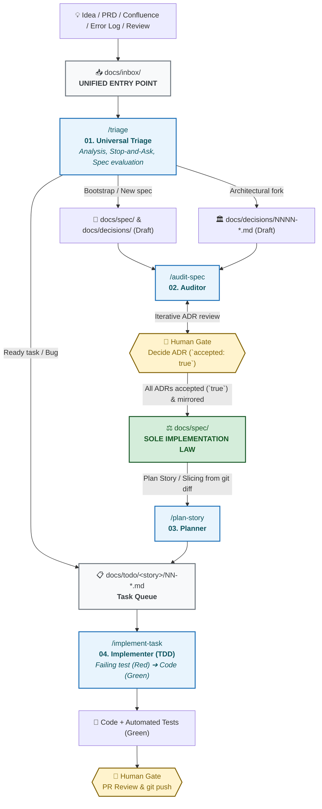

# DeltaFuse ⚡

[ **English** ](README.md) | [ Русский ](README.ru.md)

> **Specification-Driven AI Engineering Framework**
> A deterministic, agent-agnostic methodology for human-in-the-loop software development with autonomous AI agents.

[](LICENSE)
[]()

---

## 🗺️ How DeltaFuse Works (End-to-End Lifecycle)



---

## 🎯 What is DeltaFuse?

**DeltaFuse** is an operational framework for AI-native software engineering that establishes:

- **Specification (`docs/spec/`)** as the sole implementation law.
- **Unified Ingestion (`docs/inbox/`)** as the single entry point for all raw external inputs (PRDs, exports, error dumps, review notes) triaged via Inbox Zero into `docs/archive/inbox/`.
- **4 orthogonal skills** covering the entire lifecycle from idea to verified code.
- **Strict Human Gates** retaining absolute authority over architectural decisions, PR approvals, and `git push`.

---

## 🔄 DeltaFuse Skill Suite

| # | Command / Skill | Role | Primary Artifact | When to Run |
|---|---|---|---|---|
| **01** | [`/triage`](docs/process/prompts/01-triage.md) | Auditor / Triage | Spec / ADR / `docs/todo/<story>/NN-*.md` | Any raw input: new PRD, idea, review comment, or error log from `docs/inbox/` or chat. |
| **02** | [`/audit-spec`](docs/process/prompts/02-audit-spec.md) | Auditor | Report, ADRs, `docs/spec/**` | Validate consistency, mirror accepted ADRs, identify hidden forks. |
| **03** | [`/plan-story`](docs/process/prompts/03-plan-story.md) | Planner | `docs/todo/<story>/NN-*.md` | Slice accepted specification modules or spec `git diff` into atomic task files. |
| **04** | [`/implement-task`](docs/process/prompts/04-implement-task.md) | Implementer | Code, Tests, PR | Universal TDD implementation of any task file in `docs/todo/<story>/NN-*.md`. |

---

## 📁 Repository Directory Layout

```text
├── .cursorrules              # Cursor IDE instructions
├── AGENTS.md                 # Autonomous Agent & AI CLI instructions
├── CLAUDE.md                 # Claude Code CLI instructions
├── CHANGELOG.md              # Project changelog
├── docs/
│   ├── process/              # DeltaFuse methodology, roles, workflows
│   │   └── prompts/          # Procedural job prompts (01..04)
│   ├── inbox/                # UNIFIED INBOX for all incoming raw files (PRD, logs, dumps, reviews)
│   ├── decisions/            # Architecture Decision Records (ADRs)
│   ├── spec/                 # Modular specification (IMPLEMENTATION LAW)
│   │   ├── README.md         # Single acceptance entry (TOC, Tour, Coverage)
│   │   └── 00-context.md     # In/out of scope, actors, human-gated areas
│   ├── todo/                 # Atomic task queues
│   │   └── <story>/          # Story task files (NN-<slug>.md)
│   └── archive/              # Processed historical artifacts
│       └── inbox/
├── .cursor/skills/           # Cursor skills
├── .gemini/skills/           # Google Antigravity / Gemini CLI skills
└── .agents/skills/           # Universal Agent skills
```