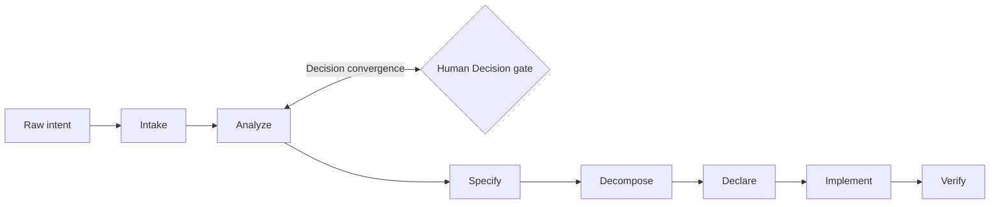

# DeltaFuse

[**English**](README.md) | [Русский](README.ru.md)

> A context-sliced, specification-driven engineering framework for AI-assisted software development.

DeltaFuse turns an unstructured feature or bug report into a typed Delta, applies it to the affected artifact layers, and proves that specification, tasks, tests, and code converge.

```text
Request -> Analyze -> Delta -> Fuse -> Converge
```

## Why DeltaFuse

Small local models fail when a workflow treats the whole repository as context. DeltaFuse routes each claim to a product capability and combines that scope with one artifact layer per operation. Every transition leaves a compact, traceable artifact.

- `docs/spec/**` is the sole implementation law.
- A Change request is provenance, not a requirement.
- A Delta may change specification, Decisions, tasks, tests, code, or only a subset.
- Implementation bugs can keep the specification unchanged and still produce tasks from analysis, exact spec references, and reproduction evidence.
- Product domains are repository-specific and evolve through a human-gated capability catalog.
- Red and Green are evidence gates, not overloaded lifecycle steps.

## Lifecycle



| Step | Skill | Primary result |
|---|---|---|
| Intake | `/intake` | Immutable request and Change root |
| Analyze | `/analyze` | Routing, slices, Decisions, typed deltas |
| Specify | `/specify` | Accepted normative state or proven unchanged spec |
| Decompose | `/decompose` | Atomic tasks inside the Change |
| Declare | `/declare` | Declared Red oracle: what must become true, proven failing on unchanged code |
| Implement | `/implement` | Minimal code and Green evidence |
| Verify | `/verify` | Convergence proof and archived Change |

Analyze repeats until all blocking Decisions are terminal and global reconciliation finds no new material question.

## Framework and product boundary

This repository is the canonical framework package:

```text
delta-fuse/
├── docs/             # canonical lifecycle, roles, context model, and rationale
├── process/          # executable framework assets
│   ├── schemas/      # Change, capability, Decision, task, evidence
│   ├── skills/       # seven operation contracts
│   └── templates/    # product artifacts and Change templates
├── scripts/          # installers
└── tests/            # product layout validators and smoke tests
```

A consuming product repository contains only product state and a pinned integration:

```text
product/
├── AGENTS.md
├── .deltafuse/
│   ├── config.yaml
│   └── lock.yaml
└── docs/
    ├── intake/
    ├── changes/<change-id>/tasks/
    ├── spec/
    ├── decisions/
    └── archive/{intake,changes}/
```

The product does not copy canonical `docs/**` and has no runtime `docs/init/**` or `docs/todo/**`. Tool-specific local skills are generated, version/hash-stamped snapshots and are not editable process sources.

## Install

```powershell
./scripts/init.ps1 -TargetDir C:\path\to\product
```

```bash
bash ./scripts/init.sh /path/to/product
```

The installer preserves existing product files. `-Force`/`--force` updates only the requested pin, lock, and generated adapters; use it after reviewing active Change versions.

Validate an installed product with `tests/validate-layout.ps1` or `tests/validate-layout.sh`.

See [canonical process documentation](docs/README.md).
