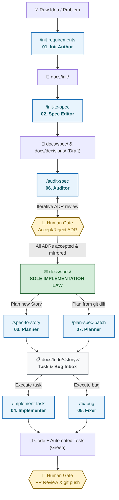

# DeltaFuse ⚡

[ **English** ](README.md) | [ Русский ](README.ru.md)

> **Specification-Driven AI Engineering Framework**
> A deterministic, agent-agnostic methodology for human-in-the-loop software development with autonomous AI agents.

---

## 🗺️ How DeltaFuse Works (End-to-End Lifecycle)

---

## 🎯 Why DeltaFuse?

Modern AI coding agents fail not because they lack coding intelligence, but because they **drift from architectural intent**. When agents work directly from chat prompts or imprecise issue descriptions, they accumulate hidden regressions, hallucinate APIs, and blur domain boundaries.

**DeltaFuse** solves this by establishing a strict, unskippable **Law Chain**:

\\	ext
┌─────────────────────────────────────────────────────────┐
│     Init Requirements  +  Architecture Decisions (ADR)  │
└───────────────────────────┬─────────────────────────────┘
                            │
                            ▼
┌─────────────────────────────────────────────────────────┐
│               Specification (docs/spec/)                │ ◄── SOLE IMPLEMENTATION LAW
└───────────────────────────┬─────────────────────────────┘
                            │
                            ▼
┌─────────────────────────────────────────────────────────┐
│              Atomic Tasks (docs/todo/)                  │ ◄── INBOX & DEFINITION OF DONE
└───────────────────────────┬─────────────────────────────┘
                            │
                            ▼
┌─────────────────────────────────────────────────────────┐
│                     Implementation                      │ ◄── CODE + AUTOMATED TESTS
└───────────────────────────┘
\
### Core Invariants

1. **Specification is Law:** Code never defines behavior; docs/spec/ does. If code and specification diverge, the specification always wins.
2. **No Spec, No Code:** Agents are strictly prohibited from implementing features or guessing business rules without an explicit imperative in docs/spec/.
3. **Surgical Spec Deltas:** Every specification modification is declared in advance via explicit ADDED / MODIFIED / REMOVED anchor lists.
4. **Zero AI Hallucination:** Architecture decisions (docs/decisions/) require human approval (status: accepted) before becoming law in the specification.
5. **Human Gates:** Humans retain sole authority over architectural acceptance, ADR state, and merging to the default branch.

---

## 🤖 Agent-Agnostic Design

DeltaFuse is designed to be completely independent of any single IDE or LLM vendor. It provides out-of-the-box adapters and standard Agent Skills for:

| Environment | Supported Interfaces | Adapter File |
|---|---|---|
| **Cursor** | Composer, Chat, Agent Skills (/commands) | .cursorrules, .cursor/skills/ |
| **Google Antigravity** | Agent CLI, Subagents, Skills | AGENTS.md, .agents/skills/ |
| **Claude Code** | CLI commands, Compact contexts | CLAUDE.md, AGENTS.md |
| **GitHub Copilot** | Workspace instructions, Chat | .github/copilot-instructions.md |
| **IntelliJ IDEA / JetBrains** | AI Assistant, Junkyard junctions, MCP | AGENTS.md, docs/process/ |
| **Windsurf / Cascade** | Rules, Prompts | AGENTS.md, .cursorrules |

---

## 🔄 The DeltaFuse Pipeline

DeltaFuse structures the software delivery lifecycle into 7 distinct, single-responsibility jobs:

| # | Job Prompt / Skill | Role | Primary Output | Trigger |
|---|---|---|---|---|
| **01** | [\/init-requirements\](docs/process/prompts/01-init-requirements.md) | Init author (draft) | docs/init/** | Capturing initial project intent and external constraints. |
| **02** | [\/init-to-spec\](docs/process/prompts/02-init-to-spec.md) | Spec editor (draft) | docs/spec/** | Compiling Init Requirements & ADRs into a modular Specification pack. |
| **03** | [\/spec-to-story\](docs/process/prompts/03-spec-to-story.md) | Planner | docs/todo/<story>/** | Slicing accepted specification into atomic, verifiable tasks and bugs. |
| **04** | [\/implement-task\](docs/process/prompts/04-implement-task.md) | Implementer | Code, Tests, PR | Implementing a single task under docs/todo/<story>/task/. |
| **05** | [\/fix-bug\](docs/process/prompts/05-fix-bug.md) | Spec editor → Implementer | Spec, Code, PR | Diagnosing and resolving a bug from docs/todo/<story>/bug/ or observation. |

---

## 🚦 Change Types & Classification

Every change in a DeltaFuse-governed repository is classified into one of four types:

- **\	rivial\**: Pure refactoring, typos, internal test improvements. Spec is unchanged.
- **\spec-patch\**: Behavioral change where the decision is obvious. Spec anchor updated and committed first, followed by code and tests.
- **\dr+spec\**: Non-obvious architectural choice. Human accepts ADR (docs/decisions/), then spec is updated, then code is written.
- **\pic\**: Multi-slice delivery sliced into atomic tasks under docs/todo/<story>/.

---

## 👥 Human vs AI Roles (RACI Matrix)

| Activity | AI Implementer | AI Planner/Auditor | Human |
|---|:---:|:---:|:---:|
| Draft Init Requirements | Consulted | Consulted | **Responsible / Accountable** |
| Draft ADR (\status: proposed\) | Consulted | Responsible | **Accountable** |
| Accept / Reject ADR | — | Consulted | **Accountable (Human Only)** |
| Modify Specification (\docs/spec/\) | Responsible (Draft) | Consulted | **Accountable (Merge)** |
| Plan & Slice Stories (\docs/todo/\) | Consulted | Responsible | **Accountable (Review)** |
| Code & Automated Tests | **Responsible** | Consulted | Accountable (Review) |
| Merge to Default Branch | — | — | **Accountable (Human Only)** |

---

## 🚀 Quick Start

### 1. Initialize DeltaFuse in your repository

**Linux / macOS:**
\\ash
curl -fsSL https://raw.githubusercontent.com/gste/delta-fuse/main/scripts/init.sh | bash
\
**Windows (PowerShell):**
\\powershell
iwr -useb https://raw.githubusercontent.com/gste/delta-fuse/main/scripts/init.ps1 | iex
\
Or copy manually from this repository:
\\ash
git clone https://github.com/gste/delta-fuse.git
./delta-fuse/scripts/init.sh /path/to/your-project
\
### 2. Recommended Directory Structure

\\	ext
your-project/
├── AGENTS.md                  # Universal standing orders for AI agents
├── CLAUDE.md                  # Pointers for Claude Code CLI
├── .cursorrules               # Pointers for Cursor IDE
├── .agents/skills/            # Agent skills (Antigravity, Gemini CLI)
├── .cursor/skills/            # Agent skills (Cursor)
├── docs/
│   ├── process/               # DeltaFuse core process documentation
│   │   ├── STATUS.md          # Lifecycle stage (bootstrap | spec-first)
│   │   ├── agent-prompt.md    # Session prompt & routing invariants
│   │   ├── workflow.md        # Change types, commits, inboxes
│   │   ├── roles.md           # Human gates and RACI
│   │   └── prompts/           # 01-05 job prompts
│   ├── init/                  # Pre-specification project intentions
│   ├── decisions/             # Architecture Decision Records (ADR)
│   ├── spec/                  # Modular specification pack (the Law)
│   │   ├── README.md          # Single acceptance entry & TOC
│   │   └── 00-context.md      # Domain boundaries & scope
│   ├── todo/                  # Active stories and task inboxes
│   └── archive/               # Historical specifications and inits
└── CHANGELOG.md               # Keep-a-Changelog unreleased ledger
\
---

## 📖 Documentation Reference

- [Adoption & Usage Guide](docs/process/using.md) — How humans and agents interact day-to-day.
- [Workflow & Change Protocol](docs/process/workflow.md) — Change types, inbox management, git commits, and DoD rules.
- [Roles & Human Gates](docs/process/roles.md) — Exact rules on what AI may do and what is strictly Human-Only.
- [Core Agent Prompt & Routing](docs/process/agent-prompt.md) — Session prompt invariants 0–10.
- [Job Prompts Directory](docs/process/prompts/README.md) — Deep dive into jobs 01 through 07.

---

## 📄 License

DeltaFuse is open-source software licensed under the [MIT License](LICENSE).
Copyright (c) 2026 gste.
