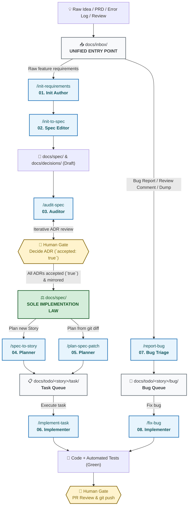

# DeltaFuse ⚡

[ **English** ](README.md) | [ Русский ](README.ru.md)

> **Specification-Driven AI Engineering Framework**
> A deterministic, agent-agnostic methodology for human-in-the-loop software development with autonomous AI agents.

[](LICENSE)
[]()

---

## 🗺️ How DeltaFuse Works (End-to-End Lifecycle)



---

## 🎯 What is DeltaFuse?

**DeltaFuse** is an operational framework for AI-native software engineering. It bridges the gap between chaotic LLM chat interactions and disciplined software development by establishing:

- **Specification (`docs/spec/`)** as the single source of truth and implementation law.
- **Unified Ingestion (`docs/inbox/`)** as the sole entry point for all raw external inputs (PRDs, exports, error dumps, review notes) triaged via Inbox Zero into `docs/archive/inbox/`.
- **AI Agents** constrained into distinct specialized roles (RACI).
- **Humans in the loop** holding absolute control over architectural forks and production deployments.

```text
┌─────────────────────────────────────────────────────────┐
│              Raw Intake (docs/inbox/)                   │ ◄── UNIFIED ENTRY POINT
└───────────────────────────┬─────────────────────────────┘
                            │
                            ▼
┌─────────────────────────────────────────────────────────┐
│               Specification (docs/spec/)                │ ◄── SOLE IMPLEMENTATION LAW
│              + Architecture (docs/decisions/)           │
└───────────────────────────┬─────────────────────────────┘
                            │
                            ▼
┌─────────────────────────────────────────────────────────┐
│               Atomic Tasks (docs/todo/)                 │ ◄── QUEUE & DEFINITION OF DONE
└───────────────────────────┬─────────────────────────────┘
                            │
                            ▼
┌─────────────────────────────────────────────────────────┐
│                    Implementation                       │ ◄── CODE + AUTOMATED TESTS
└─────────────────────────────────────────────────────────┘
```

### Core Invariants

1. **Specification is Law:** Code does not define system behaviour — `docs/spec/` does. When code and spec disagree, the specification always wins.
2. **No Spec, No Code:** Agents are strictly forbidden from implementing unstated requirements or inventing business logic.
3. **Surgical Spec Deltas:** Every specification modification is declared through precise anchors (`ADDED`, `MODIFIED`, `REMOVED`).
4. **Hallucination Prevention:** Architectural forks must be recorded as ADR drafts (`docs/decisions/`) and require human acceptance (`accepted: true`).
5. **Strict Human Gates:** Humans retain exclusive authority over ADR acceptance, PR approvals, and `git push` to remotes.

---

## 🤖 Agent-Agnostic Architecture

DeltaFuse is designed to work seamlessly across any modern IDE and LLM agent environment:

| Tool / Environment | Supported Interfaces | Adapter Files |
|---|---|---|
| **Cursor** | Composer, Chat, Agent Skills (`/commands`) | `.cursorrules`, `.cursor/skills/` |
| **Google Antigravity** | Agent CLI, Subagents, Skills | `AGENTS.md`, `.gemini/skills/`, `.agents/skills/` |
| **Claude Code** | CLI commands, Compact context | `CLAUDE.md`, `AGENTS.md` |
| **GitHub Copilot** | Workspace instructions, Chat | `.github/copilot-instructions.md` |
| **IntelliJ IDEA / JetBrains** | AI Assistant, Junkyard junctions, MCP | `AGENTS.md`, `docs/process/` |
| **Windsurf / Cascade** | Rules, Prompts | `AGENTS.md`, `.cursorrules` |

---

## 🔄 DeltaFuse Skill & Job Suite

The development lifecycle is divided into 8 distinct jobs:

| # | Command / Skill | Role | Primary Artifact | When to Run |
|---|---|---|---|---|
| **01** | [`/init-requirements`](docs/process/prompts/01-init-requirements.md) | Init Author | `docs/inbox/**` | Capture early product requirements, user stories, constraints in unified inbox. |
| **02** | [`/init-to-spec`](docs/process/prompts/02-init-to-spec.md) | Spec Editor | `docs/spec/**`, `docs/decisions/**` | Compile initial requirements from `docs/inbox/` into modular specification pack and ADR drafts. |
| **03** | [`/audit-spec`](docs/process/prompts/03-audit-spec.md) | Auditor | Report, ADRs, `docs/spec/**` | Validate consistency, mirror accepted ADRs, identify hidden forks. |
| **04** | [`/spec-to-story`](docs/process/prompts/04-spec-to-story.md) | Planner | `docs/todo/<story>/**` | Slice accepted specification modules into atomic task files. |
| **05** | [`/plan-spec-patch`](docs/process/prompts/05-plan-spec-patch.md) | Planner | `docs/todo/<story>/task/` | Automatically plan tasks directly from specification `git diff`. |
| **06** | [`/implement-task`](docs/process/prompts/06-implement-task.md) | Implementer | Code, Tests, PR | Implement single task slice with TDD strictly against spec. |
| **07** | [`/report-bug`](docs/process/prompts/07-report-bug.md) | Auditor / Triage | `docs/todo/<story>/bug/` | Triage raw bug report, review comment, or error dump from `docs/inbox/` without modifying code. |
| **08** | [`/fix-bug`](docs/process/prompts/08-fix-bug.md) | Implementer | Code, Tests, PR | Fix bug from task file in `docs/todo/<story>/bug/` with regression test. |

---

## 🚦 Change Types

Every change is categorized into one of four deterministic types:

- **`trivial`**: Refactoring, typos, internal tests. No contract or behavioral change.
- **`spec-patch`**: Behavioral change with an obvious technical design. Update spec first, commit, then code.
- **`adr+spec`**: Non-obvious architectural fork. Record ADR, wait for human acceptance, mirror into spec, then code.
- **`story`**: Multi-slice deliverable planned into atomic tasks in `docs/todo/<story>/`.

---

## 👥 Roles & Responsibility Matrix (RACI)

| Activity | AI Implementer | AI Planner / Auditor | Human |
|---|:---:|:---:|:---:|
| Draft Requirements (`docs/inbox/`) | Consulted | Consulted | **Responsible / Accountable** |
| Draft ADR (`docs/decisions/`) | — | Responsible (draft) | **Accountable** |
| **Accept ADR (`accepted: true`)** | ❌ Forbidden | ❌ Forbidden | **Human-Only** |
| Update Specification (`docs/spec/`) | Responsible (within delta) | Consulted | **Accountable (PR Merge)** |
| Slice Story into Tasks (`docs/todo/`) | — | Responsible | **Accountable** |
| Triage Bugs (`/report-bug`) | — | **Responsible** | **Accountable** |
| Code & Unit Tests | **Responsible** | Consulted | **Accountable (PR Review)** |
| **`git push` and Default Branch Merge** | ❌ **ABSOLUTELY FORBIDDEN** | ❌ **ABSOLUTELY FORBIDDEN** | **Human-Only** |

---

## 📁 Repository Directory Layout

```text
├── .cursorrules              # Cursor IDE instructions
├── AGENTS.md                 # Autonomous Agent & AI CLI instructions
├── CLAUDE.md                 # Claude Code CLI instructions
├── CHANGELOG.md              # Project changelog
├── docs/
│   ├── process/              # DeltaFuse methodology, roles, workflows
│   │   └── prompts/          # Procedural job prompts (01..08)
│   ├── inbox/                # UNIFIED INBOX for all incoming raw files (PRD, logs, dumps, reviews)
│   ├── decisions/            # Architecture Decision Records (ADRs)
│   ├── spec/                 # Modular specification (IMPLEMENTATION LAW)
│   │   ├── README.md         # Single acceptance entry (TOC, Tour, Coverage)
│   │   └── 00-context.md     # In/out of scope, actors, human-gated areas
│   ├── todo/                 # Atomic task queues
│   │   └── <story>/          # Story task slices (task/ and bug/)
│   └── archive/              # Processed historical artifacts
│       └── inbox/
├── .cursor/skills/           # Cursor skills
├── .gemini/skills/           # Google Antigravity / Gemini CLI skills
└── .agents/skills/           # Universal Agent skills
```

---

## 🚀 Quick Start

### Initialize DeltaFuse in a new or existing repository

Run the initialization script from the root of your target project:

**PowerShell (Windows):**
```powershell
& "path/to/delta-fuse/scripts/init.ps1"
```

**Bash (Linux / macOS):**
```bash
path/to/delta-fuse/scripts/init.sh
```

---

## 📄 License

Distributed under the MIT License. See [LICENSE](LICENSE) for more information.