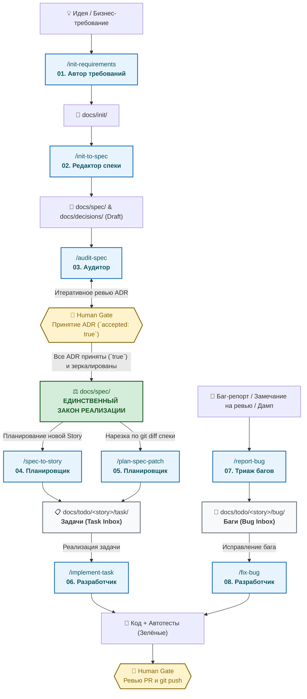

# DeltaFuse ⚡

[ English ](README.md) | [ **Русский** ](README.ru.md)

> **Specification-Driven AI Engineering Framework**
> Детерминированная, агент-независимая методология разработки программного обеспечения с участием автономных ИИ-агентов и контролем со стороны человека (Human-in-the-Loop).

[](LICENSE)
[]()

---

## 🗺️ Как устроен жизненный цикл DeltaFuse



---

## 🎯 Что такое DeltaFuse?

**DeltaFuse** — это операционный фреймворк для софтверной разработки с использованием ИИ. Он превращает хаотичное взаимодействие с нейросетями в строгий, предсказуемый инженерный процесс, где:

- **Спецификация (`docs/spec/`)** — единственный источник истины и закон для кода.
- **ИИ-агенты** выполняют роль специализированных сотрудников с четкими границами ответственности (RACI).
- **Человек** сохраняет полный контроль через непреодолимые человеческие гейты (Human Gates) в точках принятия решений.

```text
┌─────────────────────────────────────────────────────────┐
│       Исходные требования  +  Архитектурные решения     │
│             (docs/init/  +  docs/decisions/)            │
└───────────────────────────┬─────────────────────────────┘
                            │
                            ▼
┌─────────────────────────────────────────────────────────┐
│               Спецификация (docs/spec/)                 │ ◄── ЕДИНСТВЕННЫЙ ЗАКОН РЕАЛИЗАЦИИ
└───────────────────────────┬─────────────────────────────┘
                            │
                            ▼
┌─────────────────────────────────────────────────────────┐
│               Атомарные задачи (docs/todo/)             │ ◄── ИНБОКС И DEFINITION OF DONE
└───────────────────────────┬─────────────────────────────┘
                            │
                            ▼
┌─────────────────────────────────────────────────────────┐
│                     Реализация                          │ ◄── КОД + АВТОМАТИЧЕСКИЕ ТЕСТЫ
└─────────────────────────────────────────────────────────┘
```

### Ключевые инварианты

1. **Спецификация — единственный закон:** Код не задаёт поведение системы — его задаёт `docs/spec/`. Если код и спека расходятся, спека всегда побеждает.
2. **Нет спеки — нет кода:** Агенту строго запрещено реализовывать фичи или додумывать бизнес-логику без явного императивного требования в `docs/spec/`.
3. **Хирургические дельты (Spec delta):** Любое изменение спеки декларируется списком точных якорей (`ADDED`, `MODIFIED`, `REMOVED`).
4. **Защита от галлюцинаций ИИ:** Архитектурные развилки оформляются как черновики ADR (`docs/decisions/`) и вступают в силу только после одобрения человеком (`accepted: true`).
5. **Человеческие гейты (Human Gates):** Только человек имеет право принимать архитектурные решения, одобрять PR и выполнять `git push` в удалённый репозиторий.

---

## 🤖 Агент-независимая архитектура

DeltaFuse полностью нейтрален к используемой IDE и модели LLM. Он предоставляет готовые адаптеры и стандартные Agent Skills для:

| Среда | Поддерживаемые интерфейсы | Файл адаптера |
|---|---|---|
| **Cursor** | Composer, Chat, Agent Skills (`/commands`) | `.cursorrules`, `.cursor/skills/` |
| **Google Antigravity** | Agent CLI, Subagents, Skills | `AGENTS.md`, `.gemini/skills/`, `.agents/skills/` |
| **Claude Code** | CLI команды, Компактный контекст | `CLAUDE.md`, `AGENTS.md` |
| **GitHub Copilot** | Workspace instructions, Chat | `.github/copilot-instructions.md` |
| **IntelliJ IDEA / JetBrains** | AI Assistant, Junkyard junctions, MCP | `AGENTS.md`, `docs/process/` |
| **Windsurf / Cascade** | Rules, Prompts | `AGENTS.md`, `.cursorrules` |

---

## 🔄 Линейка скиллов и работ DeltaFuse

Жизненный цикл разработки разделен на 8 четких, специализированных работ:

| # | Команда / Скилл | Роль | Основной результат | Когда запускается |
|---|---|---|---|---|
| **01** | [`/init-requirements`](docs/process/prompts/01-init-requirements.md) | Автор требований | `docs/init/**` | Фиксация входящих сырых требований и ограничений. |
| **02** | [`/init-to-spec`](docs/process/prompts/02-init-to-spec.md) | Редактор спеки | `docs/spec/**`, `docs/decisions/**` | Компиляция сырых требований в модульный пакет спецификации и черновики ADR. |
| **03** | [`/audit-spec`](docs/process/prompts/03-audit-spec.md) | Аудитор спеки и ADR | Отчёт, ADR, `docs/spec/**` | Проверка непротиворечивости, зеркалирование принятых ADR в закон, поиск скрытых развилок. |
| **04** | [`/spec-to-story`](docs/process/prompts/04-spec-to-story.md) | Планировщик | `docs/todo/<story>/**` | Нарезка принятой спецификации на Story и атомарные задачи. |
| **05** | [`/plan-spec-patch`](docs/process/prompts/05-plan-spec-patch.md) | Планировщик | `docs/todo/<story>/task/` | Автоматическая нарезка задач по `git diff -- docs/spec/` после применения патча к спеке. |
| **06** | [`/implement-task`](docs/process/prompts/06-implement-task.md) | Разработчик | Код, Тесты, PR | Реализация отдельной задачи из `docs/todo/<story>/task/` по TDD. |
| **07** | [`/report-bug`](docs/process/prompts/07-report-bug.md) | Аудитор / Триаж | `docs/todo/<story>/bug/` | Триаж сырого баг-репорта, комментария с ревью или дампа, сопоставление со спекой без изменения кода. |
| **08** | [`/fix-bug`](docs/process/prompts/08-fix-bug.md) | Разработчик | Код, Тесты, PR | Исправление бага по готовой задаче из `docs/todo/<story>/bug/` по TDD. |

---

## 🚦 Типы изменений (Change Types)

Каждое изменение в репозитории классифицируется по одному из 4 типов:

- **`trivial`**: Рефакторинг, исправление опечаток, внутренние тесты. Спецификация не меняется.
- **`spec-patch`**: Изменение поведения, где решение очевидно. Сначала коммитится спека, затем код и тесты.
- **`adr+spec`**: Неочевидный архитектурный выбор. Человек принимает ADR (`docs/decisions/`), решение зеркалируется в спеку, затем пишется код.
- **`story`**: Комплексная поставка, нарезаемая на атомарные задачи в `docs/todo/<story>/`.

---

## 👥 Роли и матрица ответственности (RACI)

| Активность | Разработчик (ИИ) | Планировщик / Аудитор (ИИ) | Человек |
|---|:---:|:---:|:---:|
| Черновик требований (`docs/init/`) | Консультант | Консультант | **Ответственный / Утверждающий** |
| Черновик ADR (`docs/decisions/`) | — | Исполнитель (черновик) | **Утверждающий** |
| **Принятие ADR (`accepted: true`)** | ❌ Запрещено | ❌ Запрещено | **Только человек** |
| Правка спецификации (`docs/spec/`) | Исполнитель (в рамках дельты) | Консультант | **Утверждающий (Merge PR)** |
| Нарезка задач (`docs/todo/`) | — | Исполнитель | **Утверждающий** |
| Код и модульные тесты | **Исполнитель** | Консультант | **Ревьюер** |
| **`git push` и релиз в `main`** | ❌ **КАТЕГОРИЧЕСКИ ЗАПРЕЩЕНО** | ❌ **КАТЕГОРИЧЕСКИ ЗАПРЕЩЕНО** | **Только человек** |

---

## 📁 Структура каталогов проекта

```text
├── .cursorrules              # Инструкции для Cursor IDE
├── AGENTS.md                 # Правила для автономных агентов и AI CLI
├── CLAUDE.md                 # Инструкции для Claude Code CLI
├── CHANGELOG.md              # Журнал изменений проекта
├── docs/
│   ├── process/              # Методология DeltaFuse, роли, воркфлоу
│   │   └── prompts/          # Процедурные промпты стандартных работ (01..08)
│   ├── init/                 # Входящие сырые требования (до спецификации)
│   ├── decisions/            # Архитектурные решения (ADR)
│   ├── spec/                 # Модульная спецификация (ЗАКОН РЕАЛИЗАЦИИ)
│   │   ├── README.md         # Единая точка приёмки спеки (TOC, Tour, Coverage)
│   │   └── 00-context.md     # Границы, акторы, human-gated зоны
│   ├── todo/                 # Очередь атомарных задач
│   │   ├── inbox/            # Входящие дампы, логи, файлы комментариев
│   │   └── <story>/          # Задачи истории (task/ и bug/)
│   └── archive/              # Исторические артефакты и обработанные требования
│       ├── init/
│       └── inbox/
├── .cursor/skills/           # Скиллы для Cursor
├── .gemini/skills/           # Скиллы для Google Antigravity / Gemini CLI
└── .agents/skills/           # Универсальные скиллы для ИИ-агентов
```

---

## 🚀 Быстрый старт

### Инициализация DeltaFuse в новом или существующем репозитории

Выполните скрипт инициализации из корня вашего целевого репозитория:

**PowerShell (Windows):**
```powershell
& "path/to/delta-fuse/scripts/init.ps1"
```

**Bash (Linux / macOS):**
```bash
path/to/delta-fuse/scripts/init.sh
```

---

## 📄 Лицензия

Распространяется под лицензией MIT. См. [LICENSE](LICENSE) для подробностей.