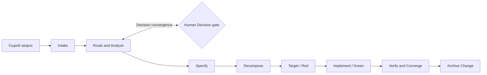

# DeltaFuse

[English](README.md) | [**Русский**](README.ru.md)

> Контекстно-нарезанный specification-driven framework для разработки программного обеспечения с помощью ИИ.

DeltaFuse преобразует неструктурированный feature- или bug-запрос в типизированную Delta, применяет её к затронутым слоям артефактов и доказывает convergence спецификации, задач, тестов и кода.

```text
Request -> Analyze -> Delta -> Fuse -> Converge
```

## Зачем нужен DeltaFuse

Небольшая локальная LLM теряет надёжность, если процесс загружает в контекст весь репозиторий. DeltaFuse маршрутизирует каждый claim в продуктовую capability и сочетает эту область только с нужным слоем артефактов. Каждый переход оставляет компактный трассируемый результат.

- `docs/spec/**` — единственный закон реализации.
- Change request хранит provenance, но не является требованием.
- Delta может затрагивать specification, Decisions, tasks, tests, code или только часть слоёв.
- Implementation bug может не менять spec: tasks выводятся из анализа, точных spec refs и reproduction evidence.
- Продуктовые домены определяются самим репозиторием и меняются через human-gated capability catalog.
- Red и Green являются evidence gates, а не перегруженными шагами lifecycle.

## Жизненный цикл



| Шаг               | Skill               | Основной результат                                           |
|-------------------|---------------------|--------------------------------------------------------------|
| Intake            | `/intake`           | Immutable request и корень Change                            |
| Route and Analyze | `/analyze-change`   | Routing, slices, Decisions, typed deltas                     |
| Specify           | `/specify-change`   | Принятое нормативное состояние или доказанный unchanged spec |
| Decompose         | `/decompose-change` | Atomic tasks внутри Change                                   |
| Target            | `/target-task`      | Падающий executable target и Red evidence                    |
| Implement         | `/implement-task`   | Минимальный code и Green evidence                            |
| Verify            | `/verify-change`    | Convergence proof и архивированный Change                    |

Route and Analyze повторяется, пока все blocking Decisions не получат terminal status, а global reconciliation не перестанет находить новые существенные вопросы.

## Граница framework и product

Этот репозиторий является каноническим framework package:

```text
delta-fuse/
├── docs/             # канонический lifecycle, роли, контекстная модель и rationale
├── process/          # исполняемые ресурсы фреймворка
│   ├── schemas/      # Change, capability, Decision, task, evidence
│   ├── skills/       # контракты семи операций
│   └── templates/    # product artifacts и шаблоны Change
├── scripts/          # installers
└── tests/            # валидаторы разметки и smoke-тесты
```

Подключённый product repository хранит только состояние продукта и pinned integration:

```text
product/
├── AGENTS.md
├── .deltafuse/
│   ├── config.yaml
│   └── lock.yaml
└── docs/
    ├── intake/
    ├── changes/<change-id>/tasks/
    ├── spec/
    ├── decisions/
    └── archive/{intake,changes}/
```

Product не копирует канонический `docs/**` и не содержит runtime-папок `docs/init/**` или `docs/todo/**`. Локальные tool-specific skills являются generated snapshots с version/hash metadata, а не редактируемым process source.

## Установка

```powershell
./scripts/init.ps1 -TargetDir C:\path\to\product
```

```bash
bash ./scripts/init.sh /path/to/product
```

Installer сохраняет существующие product files. `-Force`/`--force` обновляет только requested pin, lock и generated adapters; применять его следует после проверки версий активных Changes.

Установленный продукт проверяется через `tests/validate-layout.ps1` или `tests/validate-layout.sh`.

Подробнее: [описание процесса](docs/README.ru.md) и [обоснование context-sliced модели](docs/context-sliced-workflow-proposal.md).
