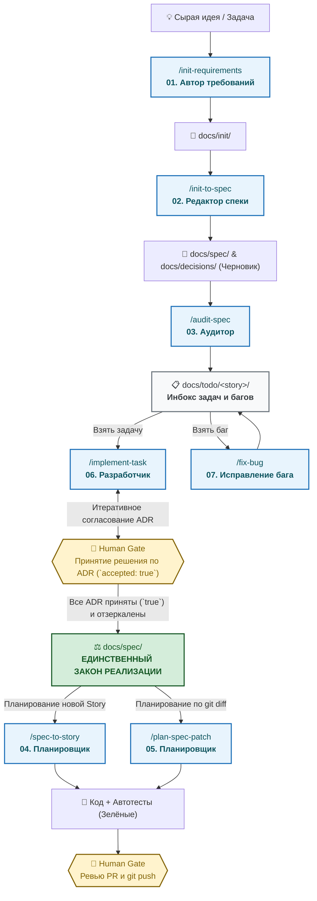

# DeltaFuse ⚡

[ English ](README.md) | [ **Русский** ](README.ru.md)

> **Фреймворк спецификационно-управляемой разработки с ИИ-агентами (Specification-Driven AI Engineering)**
> Детерминированная, агент-независимая методология разработки программного обеспечения с автономными ИИ-агентами и строгим контролем человека (Human-in-the-Loop).

[](LICENSE)
[]()

---

## 🗺️ Как работает DeltaFuse (Сквозной жизненный цикл)



---

## 🎯 Зачем нужен DeltaFuse?

Современные ИИ-агенты для написания кода ошибаются не из-за нехватки «интеллекта», а из-за **архитектурного дрейфа и потери контекста**. Работая напрямую из текста чата или размытых описаний задач, агенты незаметно накапливают регрессии, выдумывают несуществующие API и размывают границы доменов.

**DeltaFuse** решает эту проблему за счёт строгой, необратимой **Цепочки Закона (Law Chain)**:

```text
┌─────────────────────────────────────────────────────────┐
│       Исходные требования  +  Архитектурные решения     │
│             (docs/init/  +  docs/decisions/)            │
└───────────────────────────┬─────────────────────────────┘
                            │
                            ▼
┌─────────────────────────────────────────────────────────┐
│               Спецификация (docs/spec/)                 │ ◄── ЕДИНСТВЕННЫЙ ЗАКОН РЕАЛИЗАЦИИ
└───────────────────────────┬─────────────────────────────┘
                            │
                            ▼
┌─────────────────────────────────────────────────────────┐
│               Атомарные задачи (docs/todo/)             │ ◄── ИНБОКС И DEFINITION OF DONE
└───────────────────────────┬─────────────────────────────┘
                            │
                            ▼
┌─────────────────────────────────────────────────────────┐
│                     Реализация                          │ ◄── КОД + АВТОМАТИЧЕСКИЕ ТЕСТЫ
└─────────────────────────────────────────────────────────┘
```

### Ключевые инварианты

1. **Спецификация — единственный закон:** Код не задаёт поведение системы — его задаёт `docs/spec/`. Если код и спека расходятся, спека всегда побеждает.
2. **Нет спеки — нет кода:** Агенту строго запрещено реализовывать фичи или додумывать бизнес-логику без явного императивного требования в `docs/spec/`.
3. **Хирургические дельты (Spec delta):** Любое изменение спеки декларируется списком точных якорей (`ADDED`, `MODIFIED`, `REMOVED`).
4. **Защита от галлюцинаций ИИ:** Архитектурные развилки оформляются как черновики ADR (`docs/decisions/`) и вступают в силу только после одобрения человеком (`accepted: true`).
5. **Человеческие гейты (Human Gates):** Только человек имеет право принимать архитектурные решения, одобрять PR и выполнять `git push` в удалённый репозиторий.

---

## 🤖 Агент-независимая архитектура

DeltaFuse полностью нейтрален к используемой IDE и модели LLM. Он предоставляет готовые адаптеры и стандартные Agent Skills для:

| Среда | Поддерживаемые интерфейсы | Файл адаптера |
|---|---|---|
| **Cursor** | Composer, Chat, Agent Skills (`/commands`) | `.cursorrules`, `.cursor/skills/` |
| **Google Antigravity** | Agent CLI, Subagents, Skills | `AGENTS.md`, `.agents/skills/` |
| **Claude Code** | CLI команды, Компактный контекст | `CLAUDE.md`, `AGENTS.md` |
| **GitHub Copilot** | Workspace instructions, Chat | `.github/copilot-instructions.md` |
| **IntelliJ IDEA / JetBrains** | AI Assistant, Junkyard junctions, MCP | `AGENTS.md`, `docs/process/` |
| **Windsurf / Cascade** | Rules, Prompts | `AGENTS.md`, `.cursorrules` |

---

## 🔄 Линейка скиллов и работ DeltaFuse

Жизненный цикл разработки разделен на 7 четких, специализированных работ:

| # | Команда / Скилл | Роль | Основной результат | Когда запускается |
|---|---|---|---|---|
| **01** | [`/init-requirements`](docs/process/prompts/01-init-requirements.md) | Автор требований | `docs/init/**` | Фиксация входящих сырых требований и ограничений. |
| **02** | [`/init-to-spec`](docs/process/prompts/02-init-to-spec.md) | Редактор спеки | `docs/spec/**`, `docs/decisions/**` | Компиляция сырых требований в модульный пакет спецификации и черновики ADR. |
| **03** | [`/audit-spec`](docs/process/prompts/03-audit-spec.md) | Аудитор спеки и ADR | Отчёт, ADR, `docs/spec/**` | Проверка непротиворечивости, зеркалирование принятых ADR в закон, поиск скрытых развилок. |
| **04** | [`/spec-to-story`](docs/process/prompts/04-spec-to-story.md) | Планировщик | `docs/todo/<story>/**` | Нарезка принятой спецификации на Story и атомарные задачи. |
| **05** | [`/plan-spec-patch`](docs/process/prompts/05-plan-spec-patch.md) | Планировщик | `docs/todo/<story>/task/` | Автоматическая нарезка задач по `git diff -- docs/spec/` после применения патча к спеке. |
| **06** | [`/implement-task`](docs/process/prompts/06-implement-task.md) | Разработчик | Код, Тесты, PR | Реализация отдельной задачи из `docs/todo/<story>/task/` по TDD. |
| **07** | [`/fix-bug`](docs/process/prompts/07-fix-bug.md) | Редактор → Разработчик | Спека, Код, PR | Локализация дефекта, обновление спеки (при необходимости) и исправление бага. |
| **06** | [`/audit-spec`](docs/process/prompts/06-audit-spec.md) | Аудитор спеки и ADR | Отчёт, ADR, `docs/spec/**` | Проверка непротиворечивости, зеркалирование принятых ADR в закон, поиск скрытых развилок. |
| **07** | [`/plan-spec-patch`](docs/process/prompts/07-plan-spec-patch.md) | Планировщик | `docs/todo/<story>/task/` | Автоматическая нарезка задач по `git diff -- docs/spec/` после применения патча к спеке. |

---

## 🚦 Типы изменений (Change Types)

Каждое изменение в репозитории классифицируется по одному из 4 типов:

- **`trivial`**: Рефакторинг, исправление опечаток, внутренние тесты. Спецификация не меняется.
- **`spec-patch`**: Изменение поведения, где решение очевидно. Сначала коммитится спека, затем код и тесты.
- **`adr+spec`**: Неочевидный архитектурный выбор. Человек принимает ADR (`docs/decisions/`), решение зеркалируется в спеку, затем пишется код.
- **`story`**: Комплексная поставка, нарезаемая на атомарные задачи в `docs/todo/<story>/`.

---

## 👥 Роли человека и ИИ (RACI Матрица)

| Действие | ИИ Разработчик | ИИ Планировщик/Аудитор | Человек |
|---|:---:|:---:|:---:|
| Черновик требований (`docs/init/`) | Консультант | Консультант | **Ответственный / Утверждает** |
| Черновик ADR (`accepted: false`) | Консультант | Ответственный | **Утверждает** |
| Принятие решения по ADR (`accepted: true`) | — | Консультант | **Утверждает (ТОЛЬКО ЧЕЛОВЕК)** |
| Правка спецификации (`docs/spec/`) | Ответственный (Черновик) | Консультант | **Утверждает (Мердж)** |
| Планирование задач (`docs/todo/`) | Консультант | Ответственный | **Утверждает (Ревью)** |
| Написание кода и автотестов | **Ответственный** | Консультант | Утверждает (Ревью) |
| Выполнение `git push` и мердж в default branch | — | — | **Утверждает (ТОЛЬКО ЧЕЛОВЕК)** |

---

## 🚀 Быстрый старт

### 1. Инициализация DeltaFuse в проекте

**Linux / macOS (Bash):**
```bash
curl -fsSL https://raw.githubusercontent.com/gste/delta-fuse/main/scripts/init.sh | bash
```

**Windows (PowerShell):**
```powershell
iwr -useb https://raw.githubusercontent.com/gste/delta-fuse/main/scripts/init.ps1 | iex
```

Либо клонируйте репозиторий и запустите скрипт локально:
```bash
git clone https://github.com/gste/delta-fuse.git
./delta-fuse/scripts/init.sh /путь/к/вашему-проекту
```

### 2. Рекомендуемая структура проекта

```text
ваш-проект/
├── AGENTS.md                  # Универсальный свод правил для ИИ-агентов
├── CLAUDE.md                  # Указатели для Claude Code CLI
├── .cursorrules               # Указатели для Cursor IDE
├── .agents/skills/            # Agent Skills (Antigravity, Gemini CLI)
├── .cursor/skills/            # Agent Skills (Cursor)
├── docs/
│   ├── process/               # Ядро методологии DeltaFuse
│   │   ├── STATUS.md          # Стадия репозитория (bootstrap | spec-first)
│   │   ├── agent-prompt.md    # Сессионный промпт и маршрутизация
│   │   ├── workflow.md        # Протокол изменений, инбоксы, коммиты
│   │   ├── roles.md           # Человеческие гейты и роли (RACI)
│   │   └── prompts/           # Регламенты работ 01–07
│   ├── init/                  # Входящие требования до составления спеки
│   ├── decisions/             # Архитектурные решения (ADR)
│   ├── spec/                  # Пакет спецификаций (ЗАКОН)
│   │   ├── README.md          # Единая точка приёмки и оглавление
│   │   └── 00-context.md      # Границы контекста и домена
│   ├── todo/                  # Активные истории, задачи и баги
│   └── archive/               # Исторические артефакты и обработанные требования
└── CHANGELOG.md               # Журнал изменений (Keep a Changelog)
```

---

## 📖 Ссылки на документацию

- [Руководство по внедрению и использованию](docs/process/using.md) — Повседневная работа человека и агента.
- [Протокол рабочих процессов](docs/process/workflow.md) — Типы изменений, работа с инбоксами, правила коммитов и DoD.
- [Ролевая модель и Human Gates](docs/process/roles.md) — Что разрешено ИИ и что контролирует исключительно человек.
- [Базовый сессионный промпт](docs/process/agent-prompt.md) — Инварианты 0–10 и правила маршрутизации.
- [Каталог процедурных промптов](docs/process/prompts/README.md) — Подробные регламенты работ с 01 по 07.

---

## 📄 Лицензия

DeltaFuse распространяется под открытой лицензией [MIT](LICENSE).
Copyright (c) 2026 gste.
