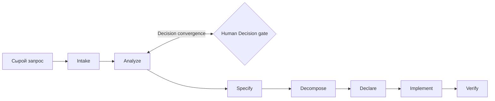

# DeltaFuse

[English](README.md) | [**Русский**](README.ru.md)

> Контекстно-нарезанный specification-driven framework для разработки программного обеспечения с помощью ИИ.

DeltaFuse преобразует неструктурированный feature- или bug-запрос в типизированную Delta, применяет её к затронутым слоям артефактов и доказывает convergence спецификации, задач, тестов и кода.

```text
Request -> Analyze -> Delta -> Fuse -> Converge
```

## Кому это нужно

DeltaFuse — для продукта, у которого спецификация является законом, Human Gate — настоящей остановкой, а Red/Green — записью прогона, а не файлом, который модель набрала в чате.

**Имеет смысл, когда:**

- `docs/spec/**` — закон реализации, а не черновик в сессии.
- Баг не должен переписывать спецификацию.
- Воркеру (LLM или человеку) нельзя пропустить `deltafuse next` и править продуктовые файлы в обход.
- Decisions, принятие spec и merge ждут человека, а не статус `accepted`, вписанный в markdown.
- Red — падающий прогон, который записало Ядро, а не YAML, составленный руками.

Сквозной режим (`/run`) ведёт lifecycle до Human Gate, упавшего гейта или пустой очереди. Семь шагов остаются; воркер не вставляет `/analyze` … `/verify`. Более лёгкие spec-driven наборы (OpenSpec, Spec Kit и аналоги) оптимизируют поток модели. DeltaFuse удерживает инвариант продукта: Ядро отказывает, если Процесс обошли.

**Достаточно более лёгкого набора, когда:**

- Фича на вечер, живой спецификации не будет.
- Команда хочет, чтобы модель сама вела plan и tasks в чате.
- Нет принятого `docs/spec/**`, нет Decision gate и нет Red-before-Green.
- Одному человеку достаточно просмотреть diff.

## Зачем нужен DeltaFuse

Небольшая локальная LLM теряет надёжность, если процесс загружает в контекст весь репозиторий. DeltaFuse маршрутизирует каждый claim в продуктовую capability и сочетает эту область только с нужным слоем артефактов. Каждый переход оставляет компактный трассируемый результат.

- `docs/spec/**` — единственный закон реализации.
- Change request хранит provenance, но не является требованием.
- Delta может затрагивать specification, Decisions, tasks, tests, code или только часть слоёв.
- Implementation bug может не менять spec: tasks выводятся из анализа, точных spec refs и reproduction evidence.
- Продуктовые домены определяются самим репозиторием и меняются через human-gated capability catalog.
- Red и Green являются evidence gates, а не перегруженными шагами lifecycle.

## Жизненный цикл



| Шаг       | Skill        | Основной результат                                                            |
|-----------|--------------|-------------------------------------------------------------------------------|
| Intake    | `/intake`    | Immutable request и корень Change                                             |
| Analyze   | `/analyze`   | Routing, slices, Decisions, typed deltas                                      |
| Specify   | `/specify`   | Принятое нормативное состояние или доказанный unchanged spec                  |
| Decompose | `/decompose` | Atomic tasks внутри Change                                                    |
| Declare   | `/declare`   | Объявленный Red-оракул: что должно стать правдой, падает на неизменённом коде |
| Implement | `/implement` | Минимальный code и Green evidence                                             |
| Verify    | `/verify`    | Convergence proof и архивированный Change                                     |

Analyze повторяется, пока все blocking Decisions не получат terminal status, а global reconciliation не перестанет находить новые существенные вопросы.

## Граница framework и product

Этот репозиторий является каноническим framework package:

```text
deltafuse/
├── docs/             # канонический lifecycle, роли, контекстная модель и rationale
├── process/          # исполняемые ресурсы фреймворка
│   ├── schemas/      # Change, capability, Decision, task, evidence
│   ├── skills/       # семь lifecycle skills и сквозной /run
│   └── templates/    # product artifacts и шаблоны Change
├── scripts/          # installers
└── tests/            # валидаторы разметки и smoke-тесты
```

Подключённый product repository хранит только состояние продукта и pinned integration:

```text
product/
├── AGENTS.md
├── .deltafuse/
│   ├── config.yaml
│   └── lock.yaml
└── docs/
    ├── intake/
    ├── changes/<change-id>/tasks/
    ├── spec/
    ├── decisions/
    └── archive/{intake,changes}/
```

Product не копирует канонический `docs/**` и не содержит runtime-папок `docs/init/**` или `docs/todo/**`. Локальные tool-specific skills — копии или ссылки инсталлера (`adapters.mode`: `auto` | `link` | `copy`) с version/hash, а не редактируемый process source.

## Установка

```powershell
./scripts/init.ps1 -TargetDir C:\path\to\product
```

```bash
bash ./scripts/init.sh /path/to/product
```

Installer сохраняет существующие product files. `-Force`/`--force` обновляет только requested pin, lock и generated adapters; применять его следует после проверки версий активных Changes.

Установленный продукт проверяется через `tests/validate-layout.ps1` или `tests/validate-layout.sh`.

Подробнее: [описание процесса](docs/README.ru.md).
