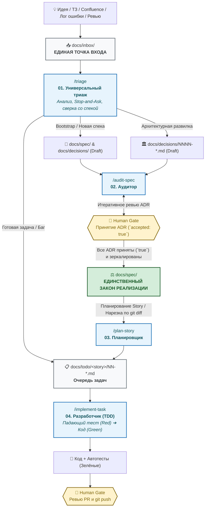

# DeltaFuse ⚡

[ English ](README.md) | [ **Русский** ](README.ru.md)

> **Specification-Driven AI Engineering Framework**
> Детерминированная, агент-независимая методология разработки программного обеспечения с участием автономных ИИ-агентов и контролем со стороны человека (Human-in-the-Loop).

[](LICENSE)
[]()

---

## 🗺️ Как устроен жизненный цикл DeltaFuse



---

## 🎯 Что такое DeltaFuse?

**DeltaFuse** — это операционный фреймворк для софтверной разработки с использованием ИИ. Он превращает хаотичное взаимодействие с нейросетями в строгий, предсказуемый инженерный процесс, где:

- **Спецификация (`docs/spec/`)** — единственный источник истины и закон для кода.
- **Единая точка входа (`docs/inbox/`)** — вся входящая сырая информация из внешнего мира (ТЗ, выгрузки, логи, замечания ревью) аккумулируется в одном месте и триажится по принципу Inbox Zero.
- **4 ортогональных скилла** закрывают весь жизненный цикл без путаницы и дублирования.
- **Человек** сохраняет полный контроль через непреодолимые человеческие гейты (Human Gates) в точках принятия решений.

---

## 🔄 Линейка скиллов DeltaFuse

Жизненный цикл разработки сведен к 4 предельно понятным скиллам:

| # | Команда / Скилл | Роль | Основной результат | Когда запускается |
|---|---|---|---|---|
| **01** | [`/triage`](docs/process/prompts/01-triage.md) | Аудитор / Триаж | Спека / ADR / `docs/todo/<story>/NN-*.md` | Любой сырой вход: новое ТЗ, идея, замечание с ревью, лог ошибки из `docs/inbox/` или чата. |
| **02** | [`/audit-spec`](docs/process/prompts/02-audit-spec.md) | Аудитор | Отчёт, ADR, `docs/spec/**` | Проверка непротиворечивости спеки, зеркалирование принятых ADR в закон, поиск скрытых развилок. |
| **03** | [`/plan-story`](docs/process/prompts/03-plan-story.md) | Планировщик | `docs/todo/<story>/NN-*.md` | Нарезка принятой спецификации или `git diff -- docs/spec/` на атомарные задачи. |
| **04** | [`/implement-task`](docs/process/prompts/04-implement-task.md) | Разработчик | Код, Тесты, PR | Универсальная TDD-реализация любой задачи из `docs/todo/<story>/NN-*.md`. |

---

## 📁 Структура каталогов проекта

```text
├── .cursorrules              # Инструкции для Cursor IDE
├── AGENTS.md                 # Правила для автономных агентов и AI CLI
├── CLAUDE.md                 # Инструкции для Claude Code CLI
├── CHANGELOG.md              # Журнал изменений проекта
├── docs/
│   ├── process/              # Методология DeltaFuse, роли, воркфлоу
│   │   └── prompts/          # Процедурные промпты стандартных работ (01..04)
│   ├── inbox/                # ЕДИНАЯ ТОЧКА ВХОДА для любых внешних файлов (ТЗ, дампы, логи, ревью)
│   ├── decisions/            # Архитектурные решения (ADR)
│   ├── spec/                 # Модульная спецификация (ЗАКОН РЕАЛИЗАЦИИ)
│   │   ├── README.md         # Единая точка приёмки спеки (TOC, Tour, Coverage)
│   │   └── 00-context.md     # Границы, акторы, human-gated зоны
│   ├── todo/                 # Очередь атомарных задач
│   │   └── <story>/          # Задачи истории (NN-<slug>.md)
│   └── archive/              # Обработанные архивные артефакты
│       └── inbox/
├── .cursor/skills/           # Скиллы для Cursor
├── .gemini/skills/           # Скиллы для Google Antigravity / Gemini CLI
└── .agents/skills/           # Универсальные скиллы для ИИ-агентов
```