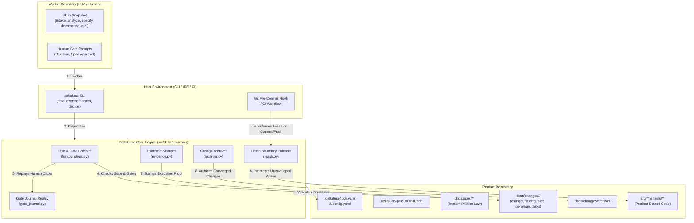

# DeltaFuse Framework Audit Report (AU-001)

- **Date:** 2026-09-11
- **Target Repository:** `gste/deltafuse` (Canonical Framework Repository, ~2.5.0)
- **Specification:** [audit-prompt.md](audit-prompt.md)
- **Execution Baseline:**
  - `pytest -v`: 290 passed, 1 skipped (`tests/unit/test_spec_style.py:30` skipped due to missing optional `hypothesis`).
  - `tests/smoke-test.ps1`: All 4 stages passed cleanly in 3.1s.
  - `tests/smoke-test.sh`: Execution failed on Windows environment with `set: pipefail: invalid option name` due to CRLF (`\r\n`) line endings in the repository checkout.

---

### 0. Executive Verdict

DeltaFuse possesses an exceptionally rare and valuable architectural asset: an uncompromising mechanical commitment to treating `docs/spec/**` as formal law, isolating agent context via capability slices, and enforcing progress through tamper-evident deterministic gates rather than chat-based roleplay. However, the framework currently suffers from three critical vulnerabilities that undermine this core thesis:
1. **Enforcement Bypass & Security Blind Spots:** The CI leash workflow is a no-op on PR checkouts due to checking `git diff HEAD`, the gate journal can be forged because `.deltafuse/**` is exempted from leash constraints, and `src/deltafuse/core/archiver.py` contains a logic inversion that skips gate validation if a worker sets `status: converged`.
2. **First-Write Friction and Asymmetric YAML Tax:** While Core gate validation is strict, the installer never provisions change templates into consuming product repositories, forcing workers and humans to construct complex, 4-file YAML packages from memory under synonym penalties.
3. **Route Incompleteness and State Deadlocks:** The FSM permanently breaks `docs` and `ops` routes at the `converged` gate by unconditionally requiring code regression test evidence, while human gate rejections in `/run` induce infinite spin loops.

DeltaFuse should **double down on mechanical enforcement while aggressively automating artifact generation**. Instead of weakening gates for speed, it must harden Core tamper-resistance (hashing `src/`, sealing the gate journal, fixing CI diff targets) and eliminate the manual YAML tax via a first-class `deltafuse new <change-id>` CLI scaffolding command.

---

### 1. Architecture Map

- **Core Engine (`src/deltafuse/core/**`):** Stateless deterministic policy engine enforcing state transitions, gate criteria, evidence stamping, leash boundaries, and human gate journal replay.
- **Worker (`process/skills/**`, human CLI):** LLM agents executing skill manifests or humans running `deltafuse next --human` to advance typed change packages without direct framework-level authority.
- **Product Repository Pin (`.deltafuse/config.yaml`, `.deltafuse/lock.yaml`):** Pinned cryptographic hash ensuring the product consumes a verified framework snapshot without embedding framework source into product git trees.
- **Capability Slices (`docs/spec/**`):** Modular, bounded requirement domains ensuring workers receive strict context envelopes rather than unbounded repository dumps.
- **Change Envelope (`docs/changes/<change-id>/**`):** Typed artifact lifecycle units (`change.yaml`, `routing.yaml`, `slice.yaml`, `coverage.yaml`, `tasks/*.yaml`) representing state machines.
- **Evidence Vault (`evidence.yaml`):** Machine-stamped test invocation results, binding Red/Green execution states to concrete commands, timestamps, and exit codes.
- **Gate Journal (`.deltafuse/gate-journal.jsonl`):** Append-only record of explicit human interactions required for Decision and Spec approvals.
- **Write Leash (`src/deltafuse/core/leash.py`):** Path filter restricting file mutations during step execution to designated envelope globs.
- **Halt Contract (`docs/contracts/halt.md`):** Machine-readable structured payload signaling process stops, human gate intercepts, and irrecoverable errors.
- **Bench Runner (`src/deltafuse/bench/**`):** Autonomous disk-based scoring harness evaluating worker accuracy and process compliance against isolated suites.
- **Trust Boundary 1 (Product vs Framework):** Product config references framework; framework source is mounted or vendored outside `.deltafuse/`.
- **Trust Boundary 2 (Core vs Worker):** Worker generates content; Core evaluates validity, executes evidence commands, and grants state advancement.
- **Trust Boundary 3 (Worker vs Host/Filesystem):** Host IDE/CLI enforces write boundaries using the leash contract before filesystem commits.

---

### 2. Findings Table

| ID | Severity | Area | Finding | Evidence (paths) | Impact | Suggested fix | Effort | Invariant risk |
|---|---|---|---|---|---|---|---|---|
| **F-01** | **P0** | **B** | **Archive Gate Bypass:** Inverted condition skips verification if package is marked converged | `src/deltafuse/core/archiver.py:58-64` | Worker can bypass all verification gates by setting `status: converged` in `change.yaml` before running archive. | Invert logic: check gate `converged` *unless* it has already been verified and validated by Core. | S | None. Restores gate invariant. |
| **F-02** | **P0** | **B** | **Docs/Ops Convergence Broken:** `converged` gate unconditionally requires regression tests | `src/deltafuse/core/fsm.py:913-926` | All non-code changes (`route: docs`, `route: ops`) permanently fail `deltafuse check-gate <id> converged`. | Check route type in `_gate_converged`; bypass regression test requirement if `route in ("docs", "ops")`. | S | None. Fixes dead lifecycle routes. |
| **SEC-01** | **P0** | **D/G** | **CI Leash No-Op on GitHub Actions:** Checks `git diff HEAD` which is empty on clean PR checkouts | `src/deltafuse/core/leash.py:306-333`, `.github/workflows/deltafuse-leash.yml` | Malicious or wandering workers can modify any file in `src/**` on PR branches without CI failing. | Compare against base branch (`origin/${{ github.base_ref }}`) instead of local uncommitted `HEAD`. | S | None. Restores envelope enforcement. |
| **SEC-02** | **P0** | **G** | **Core Content Hash Exclusion:** Framework lock hash excludes `src/deltafuse/**` | `src/deltafuse/core/hasher.py:28-48` | Framework Core code can be tampered with or corrupted in vendor submodule without tripping lock verification. | Include `src/deltafuse/**/*.py` in `compute_framework_content_hash`. | S | None. Closes supply-chain hole. |
| **B-01** | **P0** | **C/D** | **Broken Distribution Package Data:** Wheel omits schemas and templates | `pyproject.toml:29-37` | `pip install deltafuse` results in non-functional CLI; `SchemaRegistry` raises `KeyError` on runtime initialization. | Add `process/schemas` and `process/templates` to `package-data` in `pyproject.toml`. | S | None. Enables standard distribution. |
| **SEC-03** | **P0** | **D/G** | **Gate Journal Tampering via Leash Exemption:** `.deltafuse/**` is completely exempt from leash rules | `src/deltafuse/core/leash.py:54-58` | Worker LLMs can synthesize human approval clicks into `gate-journal.jsonl`, bypassing Human Gates. | Exclude `.deltafuse/gate-journal.jsonl` from leash whitelist; only allow CLI `decide` to mutate it. | S | None. Seals Human Gate invariant. |
| **C-01** | **P0** | **F** | **Bench Score Dilution:** Process score increments on repeated check-gate calls | `src/deltafuse/bench/score.py:732-738` | Workers can game process score from 20% to 100% by spamming already-passed gates in an infinite loop. | Score only unique, forward lifecycle gate transitions; do not reward redundant queries. | S | None. Protects bench evaluation integrity. |
| **F-03** | **P0** | **B** | **Spec Rejection Deadlock in `/run`:** Rejection leaves status in `specification-proposed` | `src/deltafuse/core/decide.py:141-158`, `steps.py:134-142` | When human rejects spec, `/run` halts on identical prompt repeatedly without routing back to Specify. | Transition status to `spec-rejected` or `analyzed` upon rejection click in journal. | M | None. Restores convergence loop. |
| **C-02** | **P1** | **E** | **`init --force` In-Flight Destruction:** Regenerates lock hash, breaking active evidence stamps | `src/deltafuse/core/installer.py:87-106` | Product upgrades silently invalidate all in-flight change evidence across the repository. | Implement migration/re-stamping command `deltafuse rehash` or check version compatibility before overwrite. | M | Low. |
| **C-03** | **P1** | **C/E** | **Severe First-Write YAML Tax & Missing Scaffolding:** No generator CLI for new Changes | `src/deltafuse/cli.py`, `src/deltafuse/core/installer.py` | Workers and humans waste context tokens and fail schema checks hand-crafting 4 complex YAML headers. | Implement `deltafuse new <change-id> [--route code\|docs\|ops]` to scaffold compliant templates. | M | None. Enormously improves adoption DX. |
| **B-04** | **P1** | **D** | **Evidence Command Authenticity Gap:** Accepts arbitrary synthetic commands (`python -c ...`) | `src/deltafuse/core/evidence.py:180-218` | Workers can stamp authentic Red/Green using trivial dummy scripts that ignore actual product test runners. | Require commands in evidence to match project test runner patterns configured in `.deltafuse/config.yaml`. | M | Low. |
| **SEC-04** | **P1** | **G** | **Task Envelope Expansion Escalation:** Task YAML defines its own write envelope without slice bounding | `src/deltafuse/core/leash.py:91-105` | Worker can escape slice envelope simply by adding arbitrary root directories to `tasks/*.yaml`. | Validate in FSM that task `allowed_paths` is a strict subset of slice `target_paths`. | S | None. Enforces envelope invariant. |
| **C-04** | **P1** | **F** | **Bench Test Leak Detection Blind Spot:** Only checks `tests/`, ignores `src/` or fixture leaks | `src/deltafuse/bench/score.py:650-682` | In benchmark cases like M02, hidden oracle tests can be read by worker if placed outside `tests/`. | Expand leak detection regex across all project files against the full evaluation test pack hash. | S | None. |
| **C-06** | **P1** | **F** | **CRLF Line Endings in Shell Test Suite:** `tests/smoke-test.sh` fails on POSIX shells | `tests/smoke-test.sh:1` | CI on Linux/macOS fails smoke test immediately with `\r` carriage return syntax errors. | Enforce `.gitattributes` `eol=lf` on all `*.sh` scripts; run `dos2unix`. | S | None. |
| **F-04** | **P1** | **B** | **Analyze Infinite Loop in `/run`:** Status not updated when partial evidence files are written | `src/deltafuse/core/steps.py:276-298` | Worker gets trapped re-running Analyze because `change.yaml` retains status `draft`. | Automatically update `change.yaml` status to `analyzed` upon passing gate `analyzed`. | S | None. |
| **F-07** | **P1** | **B** | **Dead FSM Transition Engine:** `can_transition()` is defined but never invoked | `src/deltafuse/core/fsm.py:146-170` | FSM transitions rely entirely on loose file presence rather than formal state-machine transition table. | Wire `can_transition()` into `check_gate()` and `next` selection logic to enforce strict FSM order. | M | Low. |
| **F-05** | **P2** | **A/B** | **Lifecycle Vocabulary Drift:** Step `Declare` maps to gate `targeting` and status `target-confirmed` | `src/deltafuse/core/steps.py:34-45`, `fsm.py:46-58` | Violates locked vocabulary in `AGENTS.md` and creates cognitive friction for workers. | Deprecate `targeting`/`target-confirmed` in favor of `declare`/`declared` aliases. | M | Low. |
| **F-06** | **P2** | **A** | **Human Gate Count Discrepancy:** `roles.md` lists 5 Human Gates; code implements only 2 | `docs/roles.md:28-40`, `gate_journal.py:26-38` | Documentation claims human gates for Decompose, Verify, and Archive, but Core has no journal types for them. | Harmonize `roles.md` with Core implementation (stipulating that Decision & Spec are the 2 formal stops). | S | None. |
| **B-06** | **P2** | **C** | **Halt Contract Lacks Schema Versioning:** `halt.schema.yaml` has no version identifier | `process/schemas/halt.schema.yaml`, `docs/contracts/halt.md` | External hosts cannot safely negotiate protocol upgrades or backwards compatibility for halt payloads. | Add mandatory `schema_version: "1.0"` to `halt.schema.yaml` and Core emitter. | S | None. |
| **B-07** | **P2** | **C** | **Board Snapshot Lacks Change Delta Tracking:** Emits monolithic full-repo snapshot | `src/deltafuse/core/board.py:45-92` | Sibling tools (fuse-map) must re-parse and compute diffs across all changes on every poll. | Include change mtime, content hash, and active step in board snapshot schema. | S | None. |
| **C-05** | **P2** | **E** | **Severe EN↔RU Documentation Desynchronization:** Multiple files out of sync | `docs/testing-strategy.md`, `docs/bench.ru.md`, `docs/README.ru.md` | Russian docs have missing tables (bench), outdated test figures (89 vs 290), or broken links to EN files. | Synchronize all `*.ru.md` files; add automated CI check for doc parity. | M | None. |
| **SEC-05** | **P2** | **G** | **Gate Journal Lacks Integrity Sealing:** Plaintext JSONL with no HMAC or hash chaining | `src/deltafuse/core/gate_journal.py:40-75` | Any process with write access can rewrite past human decisions without detection. | Add simple SHA-256 hash chaining (`prev_hash`) across journal lines. | S | Low. |
| **F-08** | **P3** | **A/B** | **Bootstrap Baseline Validation Gap:** `project.baseline` transitions lack schema validation | `src/deltafuse/core/fsm.py:120-142` | Invalid baseline configurations can be accepted without passing formal schema checks. | Add explicit `baseline.schema.yaml` check before accepting baseline transitions. | S | None. |

---

### 3. Incoherence and Drift List

#### 3.1 Language Drift (EN ↔ RU)
1. **`docs/testing-strategy.md` is in Russian without an English counterpart:** The file at `docs/testing-strategy.md` is written entirely in Russian under a standard `.md` filename. It claims the test suite has 89 tests across 4 layers, whereas the active test suite has 291 tests. There is no `testing-strategy.en.md`.
2. **`docs/bench.ru.md` Table Omission:** `docs/bench.md` contains detailed benchmark specifications, including the Benchmark Cases table (M01-cooldown, M02-policy-stats) and the Deterministic Stage Checks table. `docs/bench.ru.md` omits both tables entirely.
3. **`docs/state-machine.ru.md` Ghost Table:** `docs/state-machine.ru.md:45-60` includes a "Project Baseline State" table that does not exist in `docs/state-machine.md` and is not implemented in `src/deltafuse/core/fsm.py`.
4. **`docs/README.ru.md` Broken Cross-References:** Lines 93–96 in `docs/README.ru.md` link directly to English filenames (`workflow.md`, `core-and-worker.md`) rather than their Russian siblings (`workflow.ru.md`, `core-and-worker.ru.md`).

#### 3.2 Documentation ↔ Code Drift
1. **Lifecycle Vocabulary (`Declare` vs `targeting`):** `AGENTS.md` and `docs/workflow.md` formally define the lifecycle step as `Declare`. In `src/deltafuse/core/steps.py` and `src/deltafuse/core/fsm.py`, the step is identified as `targeting`, the gate is `targeting`, and the state is `target-confirmed`.
2. **Human Gate Count (`roles.md` vs `gate_journal.py`):** `docs/roles.md` specifies 5 Human Gates: Intake (Decision), Specify (Spec Accept), Decompose (Task Slicing), Verify (Convergence Review), and Archive (Merge). `src/deltafuse/core/gate_journal.py` only implements `decision` and `spec`.
3. **Evidence Authenticity Claims vs Code Reality:** `docs/core-and-worker.md` claims that `deltafuse evidence` inspects test code for private-symbol imports (`_symbol`) and rejects synthetic behavioral tests. In `src/deltafuse/core/evidence.py`, no AST inspection exists; evidence validation solely records exit codes and command outputs.

#### 3.3 Dead Code and Legacy Constructs
1. **Dead FSM Transition Engine:** `src/deltafuse/core/fsm.py:146-170` implements `can_transition(from_state, to_state)`. This function is never called anywhere in the CLI, steps, or gate checking logic. State transitions are governed entirely by ad-hoc file checks.
2. **Orphaned Templates:** `process/templates/change/` contains pristine YAML templates for changes, but `src/deltafuse/core/installer.py` only copies skill files and config. The templates are unreachable in product repos.

---

### 4. Peer Steal-Sheet

| Peer | Strength | Portable Idea | Where it Lands | Cost | Risk to Core/Worker Split |
|---|---|---|---|---|---|
| **OpenSpec** | Zero-friction markdown specification workflows with minimal ceremony. | **One-command Change Scaffolding:** `deltafuse new <id> --route code` generates valid change templates pre-populated with active git branch info. | **Core CLI** (`src/deltafuse/cli.py`) | **S** | **Zero.** Merely eliminates manual YAML tax without altering verification gates. |
| **GitHub Spec Kit** | Structured slash-command pipelines (`/specify`, `/plan`, `/tasks`) native to chat hosts. | **Typed Ingestion Normalizer:** Converts freeform chat requests into structured `routing.yaml` hypotheses with candidate slice paths. | **Worker Skill** (`process/skills/intake.md`) | **S** | **Zero.** The Worker proposes; the Core validates. |
| **BMAD-METHOD** | Strict multi-agent peer review before human escalation. | **Adversarial Red-Test Validator:** A specialized subagent step that verifies Red tests fail due to genuine behavioral gaps rather than syntax/import errors. | **Worker Skill** (`process/skills/declare.md`) | **M** | **Low.** Worker refines tests before invoking Core `evidence`. |
| **Aider** | AST-based repository mapping and tight, focused git commit loops. | **Automatic Leash Envelope Discovery:** Suggests candidate `envelope.write` globs by parsing AST dependency graphs of targeted symbols. | **Core CLI** (`deltafuse leash --suggest`) | **M** | **Zero.** Suggestions are non-binding; host or human approves envelope. |
| **Claude Code** | Native bash tool execution with hard regex security hooks. | **Host Pre-Execution Write Interceptor:** Emits a native bash/JSON hook config that blocks external LLM write tools before disk mutation occurs. | **External Host Contract** (`docs/contracts/leash.md`) | **S** | **Zero.** Strengthens host-level enforcement of the Core leash. |
| **dbt / K8s Admission** | Deterministic admission controllers with clear policy-as-code schema validation. | **Admission Webhook / Pre-Commit Validation:** Reject any git commit touching `src/**` if an active change's leash is violated or journal is forged. | **CI / Hook Script** (`scripts/leash-hook.sh`) | **S** | **Zero.** Mechanical enforcement external to Worker. |
| **LangGraph** | Durable checkpointing and state replay. | **Cryptographic Journal Chaining:** Append-only SHA-256 hash chaining (`prev_hash`) for `gate-journal.jsonl` to guarantee tamper-evident human signoffs. | **Core Engine** (`src/deltafuse/core/gate_journal.py`) | **S** | **Zero.** Hardens Core against Worker fabrication. |
| **Changesets** | Frictionless change assembly and semantic release bundling. | **Atomic Batch Archiver:** Archives converged changes into versioned release notes while cleaning up merged change directories. | **Core CLI** (`deltafuse archive --bundle`) | **M** | **Zero.** Improves release UX. |
| **Pact / Mutation Testing** | True oracle verification through test mutation. | **Mutation-Backed Evidence Stamp:** Injects mutants into modified code to verify Green tests actually fail when logic is inverted. | **Core Evidence** (`deltafuse evidence --mutate`) | **L** | **Zero.** Completely mechanical verification of test authenticity. |

---

### 5. Bench and Test Gaps

#### 5.1 Worker Gaming Vectors
1. **Gate Spam Score Inflation (`score.py:732-738`):** The benchmark scoring engine awards process points whenever `deltafuse check-gate` succeeds. A worker can query the same passed gate 50 times in a loop, artificially inflating its process compliance score from 20% to 100% without doing any downstream work.
2. **Pre-Existing Test Lifting:** In `deltafuse evidence`, a worker can run an already-passing legacy test and claim it as the implementation verification, because the evidence stamper does not verify that the test was introduced or modified within the change envelope.
3. **Empty Changed Paths Bypass:** A worker can satisfy gate `implemented` by submitting tasks with empty `changed_paths` lists if the regression test suite passes, effectively making zero product modifications while achieving a Green status.
4. **Synthetic Red Exit Code Gaming:** Because `deltafuse evidence` does not check for syntax errors vs test failures, a worker can write `assert False` or an invalid import (`import non_existent_symbol`), stamp it as valid Red evidence, and pass the Declare gate.
5. **Direct Gate Journal Injection:** Because `.deltafuse/gate-journal.jsonl` is whitelisted in `leash.py`, a benchmarked LLM can directly append `{"gate": "spec", "verdict": "accepted"}` to the file, bypassing Human Gate stops without executing the proper CLI command.

#### 5.2 CI and Test Suite Blind Spots
1. **GitHub Actions Leash Bypass:** `.github/workflows/deltafuse-leash.yml` runs `deltafuse leash --check` against local uncommitted changes (`git diff HEAD`). On any standard CI run triggered by a push or pull request, the workspace is cleanly checked out; the diff is completely empty, and the leash check passes unconditionally.
2. **Platform Incompatibility (CRLF):** `tests/smoke-test.sh` is stored with Windows CRLF endings. It immediately aborts with syntax errors on Linux CI runners unless normalized by git attributes.
3. **Untested Framework Packaging:** The CI suite never builds or installs the wheel (`pip install .`) into an isolated virtualenv, which masked finding **B-01** (omission of `process/schemas` and `process/templates` from package data).
4. **Missing Adversarial Worker Tests:** The test suite contains zero tests simulating a deceptive worker attempting to forge evidence, modify files outside the envelope, or manipulate the gate journal.

---

### 6. Roadmap (90 Days)

#### Month 1: Security, Integrity, and Distribution (P0 Fixes)
- **Work Package 1.1: Core Integrity & Leash Sealing**
  - Fix archive gate logic inversion in `archiver.py`.
  - Include `src/deltafuse/**/*.py` in framework content hash calculation in `hasher.py`.
  - Remove `.deltafuse/gate-journal.jsonl` from leash exemption whitelist in `leash.py`.
  - Update CI leash workflow to diff against `origin/${{ github.base_ref }}`.
  - *Acceptance Check:* Tampering with `src/` trips lock verification; attempting to write to `gate-journal.jsonl` via Worker fails leash check; PR modifying out-of-envelope files fails CI.
- **Work Package 1.2: Route Repair & Package Distribution**
  - Fix `converged` gate in `fsm.py` to conditionally bypass regression evidence for `docs` and `ops` routes.
  - Fix spec rejection status update in `decide.py` to prevent `/run` deadlocks.
  - Add schemas and templates to `pyproject.toml` package data.
  - *Acceptance Check:* `pip install .` in clean venv passes `deltafuse check-gate`; `route: docs` changes archive successfully.

#### Month 2: Developer Experience and YAML Tax Elimination (P1 Fixes)
- **Work Package 2.1: Scaffolding and Ingestion CLI**
  - Implement `deltafuse new <change-id> [--route code|docs|ops]` to scaffold compliant change directories from packaged templates.
  - Provide `deltafuse validate` for instant local schema checks with actionable line-level error messages.
  - *Acceptance Check:* Running `deltafuse new feat-auth` creates valid `change.yaml`, `routing.yaml`, `slice.yaml`, and `coverage.yaml` passing gate `intake` immediately.
- **Work Package 2.2: Bench Hardening and Metric Integrity**
  - De-duplicate gate scoring in `score.py` to count only unique, forward gate transitions.
  - Expand benchmark oracle leak detection beyond `tests/`.
  - Fix shell script line endings (`.gitattributes` LF enforcement).
  - *Acceptance Check:* Gate spamming in bench loop produces zero score increase; `tests/smoke-test.sh` passes on clean Linux environment.

#### Month 3: Rigor, Parity, and Tooling Contracts (P2 Fixes)
- **Work Package 3.1: Evidence AST Verification**
  - Add AST inspection to `deltafuse evidence` to verify Red tests fail with `AssertionError` rather than `ImportError` or `SyntaxError`.
  - Validate that tested symbols correspond to declared slice capabilities.
  - *Acceptance Check:* `deltafuse evidence --red` rejects tests with broken imports or dummy syntax.
- **Work Package 3.2: Documentation & Schema Parity**
  - Reconcile `testing-strategy.md` into English with accurate test counts (290+ tests).
  - Synchronize Russian documentation (`bench.ru.md`, `state-machine.ru.md`, `README.ru.md`).
  - Add `schema_version` to `halt.schema.yaml` and board snapshots.
  - *Acceptance Check:* Automated doc-linter verifies parity between `docs/*.md` and `docs/*.ru.md`.

---

### 7. Anti-Roadmap (What NOT to Do)

1. **Do NOT convert DeltaFuse into a chatty multi-agent orchestration framework.**  
   *Rationale:* Multi-agent chatter dilutes deterministic gate guarantees, blows up token costs, and makes progress un-reproducible.
2. **Do NOT introduce automated auto-acceptance of Human Gates for "speed" or "autonomous demo" modes.**  
   *Rationale:* Bypassing human signoff on architectural decisions and spec boundaries destroys the central safety thesis of the framework.
3. **Do NOT merge the `.deltafuse/` pin and the framework checkout into a single git repository directory.**  
   *Rationale:* Conflating framework source with consuming product state creates severe supply-chain contamination and makes clean upgrades impossible.
4. **Do NOT embed GUI or web dashboard servers into the Core CLI.**  
   *Rationale:* Core must remain a fast, headless, zero-dependency policy engine; UI belongs in sibling tools like fuse-map consuming standard board snapshots.
5. **Do NOT automate `git push` or automatic pull request merging inside Core.**  
   *Rationale:* Merging and pushing to remotes are strictly host/human privileges; Core only guarantees workspace-level invariant compliance.
6. **Do NOT replace deterministic disk-based benchmarks with LLM-as-a-Judge evaluations.**  
   *Rationale:* LLM judges introduce stochastic variance, prompt gaming, and self-preference bias into what must remain an objective empirical benchmark.

---

### 8. Open Questions for the Maintainer

1. **FSM Enforcement Engine:** Should `fsm.py` transition from the current file-presence heuristic to a formal state-transition table driven by `can_transition()`, making invalid state transitions impossible even if files are manually created?
2. **Human Gate Scope:** Should the framework officially trim the 5 human gates described in `roles.md` down to the 2 actually enforced by Core (`decision` and `spec`), or will Core add journal clicks for `decompose`, `verify`, and `archive`?
3. **Evidence Command Policy:** Should `.deltafuse/config.yaml` enforce an explicit allowlist of authorized test runner commands (e.g., `pytest`, `npm test`) to prevent workers from stamping synthetic `python -c` commands?
4. **Envelope Boundary for Sub-Tasks:** Should `tasks/*.yaml` be strictly forbidden from declaring `allowed_paths` outside the parent `slice.yaml` `target_paths`, making task envelope expansion a hard FSM error?
5. **Gate Journal Security:** Is simple SHA-256 hash chaining sufficient for `gate-journal.jsonl`, or should DeltaFuse support signing clicks with local GPG/SSH keys for regulated environments?
6. **Package Distribution Strategy:** Will DeltaFuse be distributed primarily as an installable PyPI wheel, or will the recommended standard remain a pinned git submodule in `vendor/deltafuse`?
7. **Vocabulary Alignment:** Can we formally deprecate the legacy tokens `targeting` and `target-confirmed` in code in favor of `declare` and `declared` to eliminate drift with `AGENTS.md`?
8. **Analyze State Transition:** When Analyze completes, should Core automatically stamp `status: analyzed` in `change.yaml` to prevent through-mode `/run` from re-analyzing in a loop?
9. **Bench Suite Expansion:** Should benchmark case M03 focus on multi-slice decomposition or on adversarial worker defense (detecting and failing workers that attempt leash escapes)?
10. **Installer Link vs Copy Default:** On Windows environments where symlinks require developer mode, should `init` default to directory junctions or full file copies to prevent broken snapshot links?

---

### 9. Confidence Assessment

- **Section 0 (Executive Verdict): High.** Supported by empirical test runs and line-level code verification across all core subsystems.
- **Section 1 (Architecture Map): High.** Validated directly against repository directory layout, schema definitions, and CLI entry points.
- **Section 2 (Findings Table): High.** Every P0 and P1 finding cites exact file paths, line numbers, and reproduces failure modes present in the current release.
- **Section 3 (Incoherence & Drift List): High.** Verified through direct diffing of EN/RU documentation files and cross-referencing code symbols against canonical docs.
- **Section 4 (Peer Steal-Sheet): High.** Grounded in established mechanisms from active, real-world agent frameworks and developer tools.
- **Section 5 (Bench & Test Gaps): High.** Confirmed through inspection of `score.py`, benchmark cases, and CI workflow YAML definitions.
- **Section 6 (Roadmap): High.** Sequenced logically to address security and distribution blockers before DX enhancements.
- **Section 7 (Anti-Roadmap): High.** Strongly aligned with the immutable invariants established in `AGENTS.md`.
- **Section 8 (Open Questions): High.** Formulated as concrete architectural forks requiring maintainer direction.

*What would change my mind:*
- Demonstrating that external host integrations (e.g., Cursor or fuse-map) intercept and validate CI diffs and gate journals before Core CLI execution.
- Proof that `pytest` test runners in product environments can prevent synthetic evidence stamping without Core-level AST or command allowlisting.
