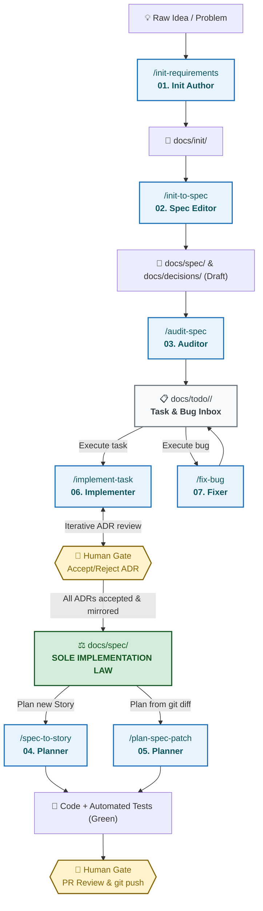

# DeltaFuse

Фреймворк работы через спецификацию. Репозиторий ядра: `delta-fuse`.

Переиспользуемые, **продукт-агностичные** правила совместной работы человека и агентов. Ядро в репозитории: `AGENTS.md` + этот каталог.

Аудитория: человек. Как подключить и кем что делается — [`using.md`](./using.md). Закон продукта живёт только в `docs/spec/`.

## Law chain

```text
Init Requirements + Architecture Decisions (ADR)
    → Specification (docs/spec/)      ← единственный закон реализации
        → Atomic tasks (docs/todo/)
            → Implementation
```

## 🗺️ How DeltaFuse Works (End-to-End Lifecycle)



---

## Rules

1. **Реализация читает только `docs/spec/`.**  
   Не чат, не Init Requirements, не текст ADR сам по себе.
2. **ADR объясняет *почему*. Спека фиксирует, *что должно быть истинным*.**  
   Принятый ADR зеркалится в `docs/spec/` как императивные требования.
3. **После приёмки SDD-пакета Init Requirements историчны.**  
   Держим их в `docs/init/` только до приёмки, затем переносим в `docs/archive/` (или считаем необязывающими).
4. **`docs/todo/` — входящая очередь, а не вторая спека.**  
   Живые слайсы ссылаются на секции спеки и несут DoD. Закрытые — одна строка в таблице Closed корневого [`docs/todo/README.md`](../todo/README.md). Тела задач после закрытия не хранятся.
5. **Никаких доменных требований в `docs/process/`.**  
   Доменный закон живёт только в `docs/spec/`.
6. **Живая спека, дельта снаружи.**  
   `docs/spec/` описывает только текущее устройство системы — без changelog-лент. Намерение изменения объявляется как Spec delta (`ADDED` / `MODIFIED` / `REMOVED` + якоря) в `docs/todo/` и в теле PR; `git diff` лишь проверяет, что правка осталась внутри этой дельты.

## Language

| Слой                                                                                                                         | Язык       | Причина                                                               |
|------------------------------------------------------------------------------------------------------------------------------|------------|-----------------------------------------------------------------------|
| Проза `docs/process/**`, `docs/spec/**`, `docs/init/**`, `docs/todo/**`                                                      | русский    | это держит в голове RU-команда                                        |
| Корневой `README.md`                                                                                                         | русский    | how-to оператора; не спецификация                                     |
| Корневой `CHANGELOG.md`                                                                                                      | русский    | формат банка; агент пишет только пункт в Unreleased                   |
| Сообщения git                                                                                                                | английский | история репозитория                                                   |
| Ответы человеку в чате                                                                                                       | русский    | та же аудитория, что у спеки; исключение — реплика человека на EN     |
| `AGENTS.md`, `.cursor/skills/**`                                                                                             | английский | читают в основном агенты                                              |
| Заголовки, якоря, имена файлов, requirement ID, идентификаторы кода                                                          | английский | стабильные ссылки, grep, перекрёстные ссылки не ломаются при переводе |
| Имена терминов внутри русского текста (`DeltaFuse`, `Spec delta`, `stage`, `spec-patch`, `human-gated`, `ADDED` / `MODIFIED` / `REMOVED`) | английский | одно правило — одно название                                          |

Ядро продукт-агностично, но не язык-агностично: переносимость в англоязычную команду потребует перевода.

## Repository layers

| Слой                  | Расположение      | Содержание                           | Переносимо?      |
|-----------------------|-------------------|--------------------------------------|------------------|
| Инструкции агентам    | `AGENTS.md`       | как агент обязан работать            | файл целиком     |
| Описание процесса     | `docs/process/`   | контроль изменений + job-промпты     | файлы целиком    |
| Init Requirements     | `docs/init/`      | что мы собирались построить (до SDD) | только структура |
| Архитектурные решения | `docs/decisions/` | почему выбрали вариант A             | только структура |
| Спецификация (SDD)    | `docs/spec/`      | что именно мы строим                 | только структура |
| Активные задачи       | `docs/todo/`      | живые слайсы + Closed                | только структура |
| Архив                 | `docs/archive/`   | вытесненный init, старые спеки       | только структура |

## Process files in this folder

| Файл                                       | Назначение                                                   |
|--------------------------------------------|--------------------------------------------------------------|
| [`using.md`](./using.md)                   | как подключить DeltaFuse и кто что делает                    |
| [`workflow.md`](./workflow.md)             | типы изменений, конвейер, inbox, коммиты агента, CHANGELOG   |
| [`roles.md`](./roles.md)                   | полномочия человека и агента, гейты                          |
| [`agent-prompt.md`](./agent-prompt.md)     | ядро сессии: инварианты и маршрутизация к job-промпту        |
| [`STATUS.md`](./STATUS.md)                 | текущая стадия жизненного цикла (`bootstrap` / `spec-first`) |
| [`prompts/README.md`](./prompts/README.md) | реестр job-промптов, по одному на работу конвейера           |
| [`../../AGENTS.md`](../../AGENTS.md)       | постоянные распоряжения, которые агент загружает первыми     |

Как подключить ядро в другой репозиторий и кто что делает день за днём — [`using.md`](./using.md).

## Where to go next

| Вы…                        | Открывайте                                                            |
|----------------------------|-----------------------------------------------------------------------|
| человек, впервые           | [`using.md`](./using.md) → этот файл → `workflow.md` → `roles.md`     |
| человек, принимаете пакет  | `docs/spec/README.md` — единственная точка ревью (TOC + review tour)  |
| человек, меняете поведение | `docs/spec/` (и ADR, если выбор неочевиден)                           |
| агент, начинает сессию     | `agent-prompt.md` (core prompt) → job-промпт из таблицы маршрутизации |
| агент, реализует `task`    | `AGENTS.md` → файл в `docs/todo/<story>/task/` → связанные секции спеки |
| агент, исправляет баг      | `AGENTS.md` → файл в `docs/todo/<story>/bug/` → связанные секции спеки |
| агент, планирует история      | `workflow.md` (раздел story) + `docs/todo/README.md` + `docs/spec/README.md` |
