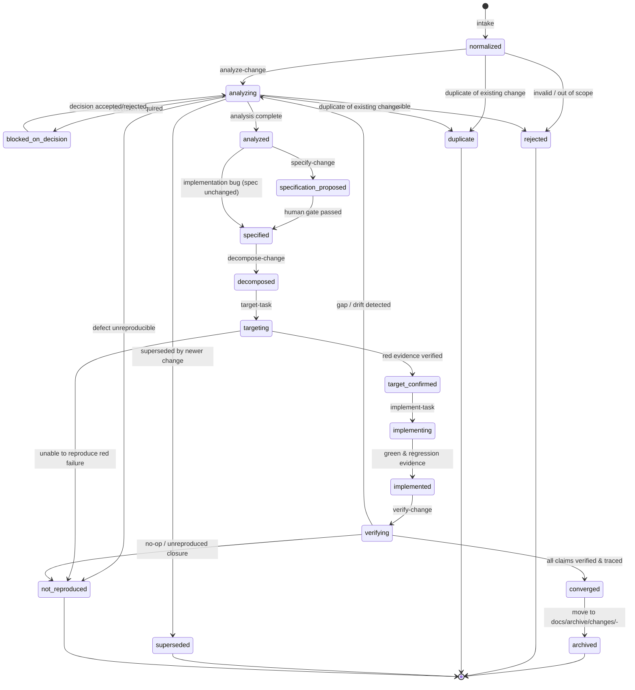
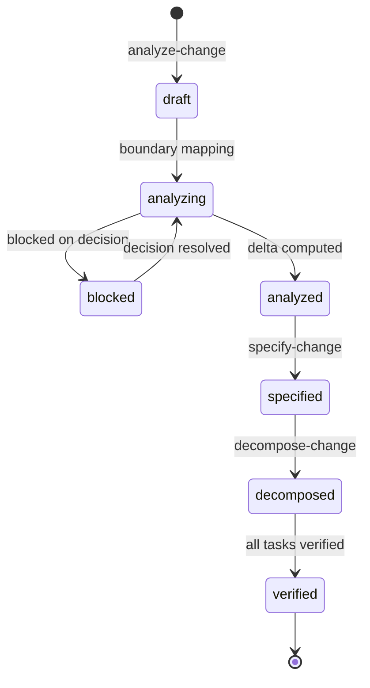
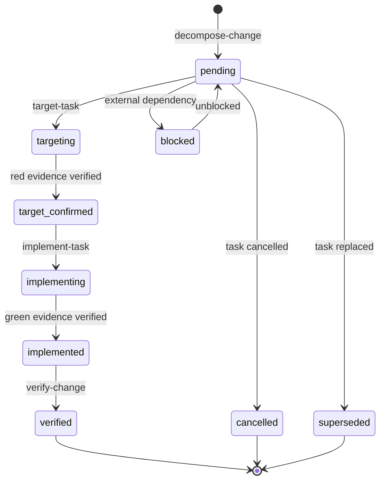
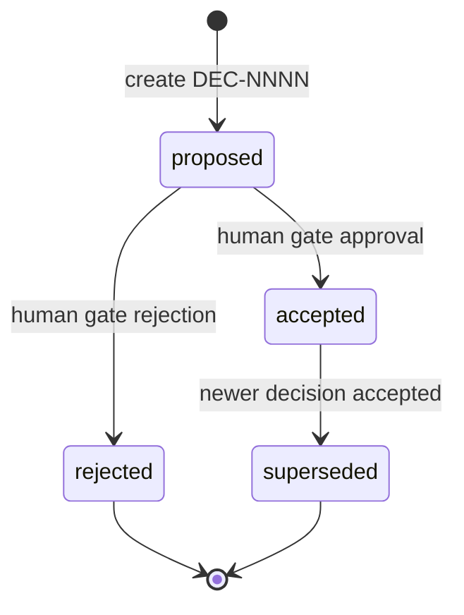
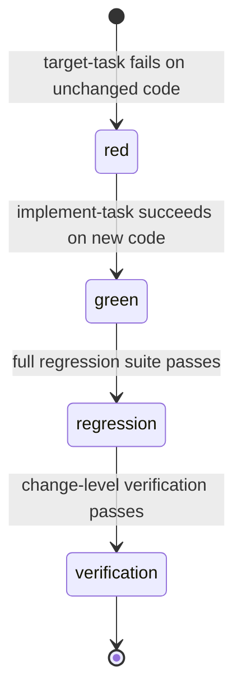

# State Machine Specification

[**English**](state-machine.md) | [Русский](state-machine.ru.md)

This document formally defines the state machines for the primary DeltaFuse entities: **Change**, **Slice**, **Task**, **Decision**, and **Evidence**.

---

## Change Lifecycle State Machine

A Change is the complete lifecycle container for an atomic set of modifications to a product.

### Complete Change Status Table

| Status | Description | Allowed Next Statuses | Transition Gate / Precondition |
|---|---|---|---|
| `normalized` | Initial normalized request in `CHG-NNN/request.md`. | `analyzing`, `rejected`, `duplicate` | Request passes schema and format checks. |
| `analyzing` | Routing and slice analysis in progress. | `blocked-on-decision`, `analyzed`, `rejected`, `duplicate`, `superseded`, `not-reproduced` | Initial capability routing mapped. |
| `blocked-on-decision` | Blocked waiting for human decision on a `DEC-*` record. | `analyzing` | At least one blocking decision in `proposed`. |
| `analyzed` | Routing, deltas, and slices computed; coverage mapped. | `specification-proposed`, `specified` (bug: spec unchanged) | Zero unaccepted blocking decisions. |
| `specification-proposed` | Changes to `docs/spec/**` drafted in `spec-delta.md`. | `specified` | Human approval of specification delta. |
| `specified` | Normative specification updated (or proven unchanged for bugs). | `decomposed` | Live `docs/spec/**` files and a valid `_capabilities.yaml` exist, or unchanged spec is proven by exact existing `spec_refs`; `spec-delta.md` is not sufficient alone. |
| `decomposed` | Slices broken down into atomic dependency-ordered tasks. | `targeting` | All tasks validated against `task.schema.yaml`. |
| `targeting` | Preparing failing test targets for tasks. | `target-confirmed`, `not-reproduced` | Test target executed; fails with Red evidence (or proves unreproducible). |
| `target-confirmed` | Verified Red evidence recorded for all tasks. | `implementing` | Human review of Red evidence if required. |
| `implementing` | Authoring minimal code to turn tests green. | `implemented` | Tests pass; Green and Regression evidence recorded. |
| `implemented` | All tasks implemented and verified locally. | `verifying` | All task targets green; no regression failures. |
| `verifying` | End-to-end traceability and convergence check. | `converged`, `analyzing`, `not-reproduced` | All claims mapped to green tests and spec (or no-op closure). |
| `converged` | Convergence proven; package ready for archiving. | `archived` | Verification evidence recorded in `verification/run.yaml`. |
| `archived` | Moved to `docs/archive/changes/<date>-<change-id>`. | *Terminal* | Directory moved to archive root. |
| `rejected` | Rejected as unfeasible or out of scope. | *Terminal* | Rationale documented in `analysis.md`. |
| `duplicate` | Identified as duplicate of another Change. | *Terminal* | Link to primary `CHG-*` documented in `change.yaml`. |
| `not-reproduced` | Defect not reproduced during analysis, targeting, or verification. | *Terminal* | Diagnostic proof or evidence recorded with `result: not-reproduced` in `evidence/` or `verification.md`. |
| `superseded` | Superseded by a newer or broader Change. | *Terminal* | Superseding Change reference recorded. |

---

## Slice Lifecycle State Machine

A Slice is an autonomous, independently verifiable capability slice within a Change.

### Slice Statuses

| Status | Description | Allowed Next Statuses |
|---|---|---|
| `draft` | Slice boundary draft created during routing. | `analyzing` |
| `analyzing` | Delta computation and dependency analysis. | `blocked`, `analyzed` |
| `blocked` | Blocked waiting for architectural or domain decision. | `analyzing` |
| `analyzed` | Boundary, deltas, and affected modules resolved. | `specified` |
| `specified` | Applicable spec modifications completed and approved. | `decomposed` |
| `decomposed` | Tasks for slice created and dependency-ordered. | `verified` |
| `verified` | All slice tasks implemented and verified. | *Terminal* |

---

## Task Lifecycle State Machine

A Task is an atomic, independently verifiable work unit owned by a specific Slice.

### Task Statuses

| Status | Description | Allowed Next Statuses | Gate / Precondition |
|---|---|---|---|
| `pending` | Task defined in `tasks/TASK-NNN.md`. | `targeting`, `blocked`, `cancelled`, `superseded` | Task matches `task.schema.yaml`. |
| `targeting` | Test target being written. | `target_confirmed` | Test runs and fails for expected reason. |
| `target-confirmed` | Verified Red evidence recorded. | `implementing` | Evidence file in `evidence/red/<task-id>.yaml`. |
| `implementing` | Implementation code being authored. | `implemented` | Tests pass; regression suite passes. |
| `implemented` | Green & regression evidence recorded. | `verified` | Evidence in `evidence/green/` & `regression/`. |
| `verified` | Cross-layer convergence confirmed by verifier. | *Terminal* | End-to-end verification step completes. |
| `blocked` | Implementation blocked by dependency or issue. | `pending` | Blocking reason documented. |
| `cancelled` | Task cancelled during Change lifecycle. | *Terminal* | Cancellation rationale documented. |
| `superseded` | Task replaced by finer-grained tasks. | *Terminal* | Superseding task IDs documented. |

---

## Decision Lifecycle State Machine

Decisions are recorded in `docs/decisions/DEC-NNNN-*.md` (decisions may be bound to a Change via `change: CHG-NNN`, or created at repository/Bootstrap level with `change: null`):

### Decision Invariants
- **AI may only draft** decisions in `status: proposed`.
- **Only a human** may transition a decision to `accepted` or `rejected`.
- An accepted decision becomes repository policy; its rationale cannot be silently revoked without a new superseding Decision.

---

## Evidence Lifecycle State Machine

Evidence is the machine-verifiable proof of behavior recorded at each critical stage:

### Evidence Phases and Locations

| Phase | Required Path | Scope | Task ID Requirement |
|---|---|---|---|
| `red` | `evidence/red/<task-id>.yaml` | Task test fails on unmodified production code. | Required (`task: TASK-NNN`) |
| `green` | `evidence/green/<task-id>.yaml` | Task test passes on updated production code. | Required (`task: TASK-NNN`) |
| `regression` | `evidence/regression/<task-id>.yaml` | Full domain regression suite passes without regression failures. | Required (`task: TASK-NNN`) |
| `verification` | `evidence/verification/run.yaml` | End-to-end Change verification run confirms all claims and deltas. | Optional / Null (`task: null`) |

---

## Versioning Invariants

1. **Schema Version Compatibility**: All product artifacts (`change.yaml`, `routing.yaml`, `coverage.yaml`, `_capabilities.yaml`, `evidence/*.yaml`, `tasks/*.md`, `slices/*.md`, `decisions/DEC-*.md`) must strictly match `schema_version: 2`.
2. **Deterministic Locking**: The `.deltafuse/lock.yaml` file stamps the exact framework version, source URI, and content hash. Products cannot proceed through gates if `config.yaml` version or source mismatches `lock.yaml`.
